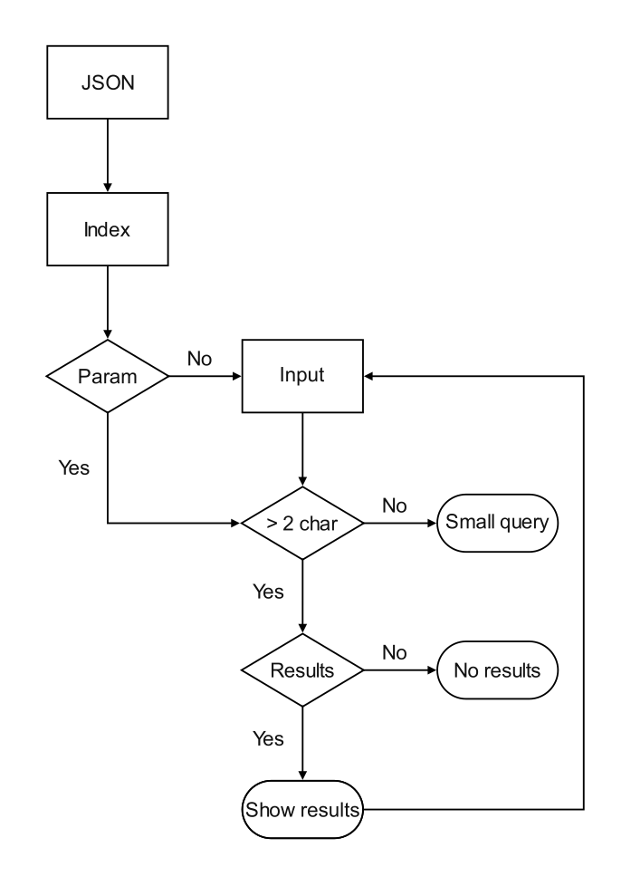

## Introduction

I think it's safe to say that the internet is currently undergoing a massive change due to the rise of Jamstack and various SSGs. The same stuff that needed huge backend scripts is now possible using something as primitive as HTML + CSS + JS (and their flavours). However, even though these technologies try to bridge the gap between static and dynamic websites, there are still some classic features of the dynamic websites that are not very easy to port to static websites. One of them is the site search.

## The problem

With static websites growing larger in sizes, users of such websites might find themselves to be lost and for such cases, a search feature is a must. As of the time of writing this post, no SSG has an out-of-the-box feature to search the websites. However, thanks to the efforts of some JavaScript experts, we can bring a subset of this feature to our websites.

### Client-side search

Then the question arises, why a client-side search, especially when there exist so many good third-party search services, including but not limited to Google Programmable Search Engine, Algolia Search, and lots more. They are not only highly powerful but also easy to plug into your website. While they're all great and better, they have their own set of problems. Probably, the biggest one is that they're from a third-party that is, they can get discontinued, or the features and pricing might change, they own the data, and many such issues. Even more, they're not perfectly customisable and are not white-labelled (at least for free).

Thus, I chose the client-side search approach. It's supposed to fix most of the problems mentioned above, however, the quality of results might not be as great as the third-party alternatives. With that being said, let's dive into how it's done.

## Step-by-step guide

While the below-mentioned solution is supposed to work with Hugo, it should work with almost any website that works with HTML, CSS and JavaScript, with little or no modifications.

We're going to use a JavaScript library to handle the indexing and searching for us. The library is [FlexSearch.js](ext:https://github.com/nextapps-de/flexsearch). It claims to be the fastest one to do its task and it's also super lightweight and moderately easy to use. It needs all the text to index, pass the data and let it build its index and then it returns the results as an array which we can map and display as individual results.

Here's how the workflow will be:



We want to make maximum use of automation, so that once the setup is done, no matter how and how many posts we add, the feature works just the same.

### Generating the JSON

Create a file `/layouts/index.json` with the following content:

```GO
{{- .Scratch.Set "pagesIndex" slice -}}
{{- range where .Site.RegularPages "Type" "in" .Site.Params.mainSections -}}
    {{- $pageData := (dict "title" .Title "description" .Description "href" .RelPermalink "content" ((replaceRE "(<pre.*>(.|\n)*?</pre>)|(<code.*>(.|\n)*?</code>)|()|(<canvas.*></canvas>)|(<h[2-4].*>(.|\n)*?</h[2-4]>)|(<[^>]*>)|(  )|(\\n)|(\\t)" "" (replaceRE "(</li>)|(</p>)" " " .Content)) | htmlUnescape)) -}}
  {{- $.Scratch.Add "pagesIndex" $pageData -}}
{{- end -}}
{{- .Scratch.Get "pagesIndex" | jsonify -}}
```

Then, add the following to your `config.toml`:

```TOML
[outputs]
  home = ["HTML", "JSON"]

[params]
  mainSections = ["section1", "section2"]
```

This will generate the desired JSON. Let me walk you through it.

* `Line 1`: We begin by declaring a `.Scratch` named `pagesIndex` that stores a slice. We'll use this later.

* `Line 2 - 5`: We range through all the posts in the sections defined in the `mainSections` parameter in `config.toml`. We're using `mainSections` to avoid inclusion/exclusion of any unwanted/wanted post.

  * `Line 3`: We now define another variable `pageData` that stores the Title, Description, Link and the Content in it. The Content is however processed using RegEx. The generated RegEx filters out unwanted content from our Markdown. This was needed because even when you use `.Plain`, Hugo doesn't strip out the content within the `<pre>` tag. Thus, when displaying the search results, there are chances that such a tag might get executed by the browser. So, I have found the RegEx that works perfectly for my need. First, it adds spaces between the closing `<li>` and `<p>` tags. Then, it removes all content within `<pre></pre>`, `<code></code>`, ``, `<canvas></canvas>`, `<h2></h2>`, `<h3></h3>`, `<h4></h4>` tags, the rest of the tag identifiers and the special characters such as `  `, `\n` and `\t`. The reason I chose to strip the contents within the three heading tags is that I didn't want the section headings (the headings I use in my table of contents), to show up in the search results. You're free to customise this RegEx. Finally, the corrected content goes through `htmlUnescape` to convert all escaped characters back to original.

  * `Line 4`: The page data is now added to the page index. Since it's inside a `range`, it's done one by one for all the posts.

* `Line 6`: The final index is then `JSONified`.

### Writing the mark-up

After generating the JSON, we now need to create the HTML mark-up to show a form to the users. Note that, my website users UIkit, so the mark-up includes some specific classes and DOM structure which might not be intended for you, but it might give you a basic idea.

```HTML
<head>
  <link href = "/css/uikit.css" rel = "stylesheet">
  <script src = "/js/uikit.js" defer></script>
  <script src = "/js/flexsearch.js" defer></script>
</head>
<body>
  <form class = "search-form" autocomplete = "off">
    <div class = "uk-inline">
      <a class = "uk-form-icon uk-form-icon-flip search-button">
        <svg class = "icon">
          <use xlink:href = "/images/sprites.svg#mi-search"></use>
        </svg>
      </a>
      <input class = "uk-input uk-form-width-large search-input" type = "search" placeholder = "Search">
    </div>
  </form>
  <div class = "search-results"></div>
</body>
```

The HTML part is pretty self-explanatory. Note that, there's an empty `<div class = "search-results">`. We'd be using this element to show our results.

In Hugo, you can create a separate page by creating a file `/content/search.md` with the following content:

```MD
---
layout: "search"
---
```

... and using the above HTML code in `/layouts/page/search.html`.

### Styling the page

This part is purely optional. The HTML has the required CSS classes, you're free to style them as you see fit.


### The search logic

Now we finally come to probably the most important part of this feature - the JavaScript code. This is where the magic actually happens. I have tried to keep it as minimal as possible, yet fairly functional. I won't say this is the best way or the most optimal code, as my skills in JavaScript are far from polished, but it gets the work done. Please note, if you've changed the HTML, you'd also have to update the JavaScript to reflect the changes.

```JS
window.addEventListener('load', () => {
  var pagesIndex;
  var searchIndex;
  var resultsArray;
  var params = new URLSearchParams(location.search);
  var searchInput = document.querySelector('.search-input');
  var resultsContainer = document.querySelector('.search-results');
  var clickHandler = (function clickHandler(event) {
    event.preventDefault();
    resultsContainer.querySelector('.clear-button').removeEventListener('click', clickHandler);
    searchInput.value = '';
    resultsContainer.innerHTML = '';
    resultsContainer.style.marginTop = 0;
    history.replaceState('', '', './');
    return clickHandler;
  });
  (async () => {
    var indexFile = await fetch('/index.json');
    pagesIndex = await indexFile.json();
    searchIndex = new FlexSearch();
    pagesIndex.forEach(page => {
      searchIndex.add(page.href, page.content + page.title);
    });
    switch (params.has('q')) {
      case true:
        searchInput.value = params.get('q');
        searchSite();
        break;
      default:
        break;
    };
  })();
  var searchSite = (function searchSite(event) {
    switch (this == window) {
      case true:
        break;
      default:
        event.preventDefault();
    };
    resultsArray = [];
    switch (searchInput.value.trim().length <= 2) {
      case true:
        history.replaceState('', '', './');
        resultsContainer.style.marginTop = '20px';
        resultsContainer.innerHTML = '<p>Please enter some text (longer than 3 characters) to search</p><a href=# class="uk-button clear-button" data-turbo=false><svg class="icon icon-primary uk-margin-small-right"><use xlink:href=/images/sprites.svg#mi-backspace></use></svg><span>Clear</span></a>';
        resultsContainer.querySelector('.clear-button').addEventListener('click', clickHandler);
        break;
      default:
        searchIndex.search(searchInput.value.trim()).map(result => {
          var resultMatches = pagesIndex.find(resultMatch => result === resultMatch.href);
          resultMatches.correctedContexts = [];
          var matchedResults = resultMatches.content.match(new RegExp('[^\.]*(' + searchInput.value.trim() + ')[^\.]*', 'gmi'));
          switch (matchedResults) {
            case null:
              resultMatches.correctedContexts.push(resultMatches.description);
              break;
            default:
              matchedResults.forEach(context => {
                resultMatches.correctedContexts.push(context.trim().replace(new RegExp(searchInput.value.trim(), 'gi'), '<mark>$&</mark>'));
              });
          };
          resultsArray.push(resultMatches);
        });
        switch (resultsArray.length > 0) {
          case true:
            switch (resultsArray.length > 1) {
              case true:
                var resultCount = resultsArray.length + ' results';
              default:
                var resultCount = resultsArray.length + ' result';
            };
            history.replaceState('', '', './?q=' + searchInput.value.trim());
            resultsContainer.style.marginTop = '20px';
            resultsContainer.innerHTML = `<p>Found ${resultCount} for <mark>${searchInput.value.trim()}</mark></p>` + resultsArray.map(result => `<div><h3 class=uk-margin-remove>${result.title}</h3><p>` + result.correctedContexts.map(context => `<span>${context}</span>`).join('<span>... </span>') + `</p><a href=${result.href} class="uk-button uk-text-left arrow-btn"><span>Read more</span><svg class="icon icon-primary uk-margin-small-left"><use xlink:href="/images/sprites.svg#mi-east"></use></svg></a></div>`).join('<hr/>') + `<a href=# class="uk-button uk-margin-small-top clear-button" data-turbo=false><svg class="icon icon-primary uk-margin-small-right"><use xlink:href=/images/sprites.svg#mi-backspace></use></svg><span>Clear</span></a>`;
            resultsContainer.querySelector('.clear-button').addEventListener('click', clickHandler);
            break;
          default:
            resultsContainer.style.marginTop = '20px';
            resultsContainer.innerHTML = '<p>No results found for ' + searchInput.value.trim() + '</p><a href=# class="uk-button clear-button" data-turbo=false><svg class="icon icon-primary uk-margin-small-right"><use xlink:href=/images/sprites.svg#mi-backspace></use></svg><span>Clear</span></a>';
            resultsContainer.querySelector('.clear-button').addEventListener('click', clickHandler);
        };
    };
    return searchSite;
  });
  searchInput.addEventListener('input', searchSite);
  searchInput.parentElement.parentElement.addEventListener('submit', searchSite);
});
```

To begin with, we're running this entire piece of code inside the `window load` event. This is to make sure the DOM is all ready for my JavaScript to manipulate it, especially because we're loading the JavaScript using `defer` attribute.

* `Line 2 - 16`: We're declaring various variables that we'll need in the rest of the code. Some are just declared, while some are defined. The `line 8 - 16` is defining a function to add a `click event listener` to our clear button which we would dynamically add in some time. Clicking it would clear the results, reset the search input, reset the URL and even remove the event listener. 

* `Line 17 - 32`: We're declaring a self-executing `async` function to initialise and build a search index from the JSON file. It's important to make it `async` because we need to use `await` statements. This is because JavaScript is synchronous in nature (by default). So, anything that we start processing would continue to do so until it ends, and thus the main thread would be busy, pausing execution of anything else. We need to keep it `async` because the JSON file could be over a few hundred kibibytes in some cases, and depending on the user's network, it might take time to load. In such cases, if we don't make it `async`, the rest of the JavaScript won't work till the JSON loads.

  * We first let the JSON load and then tell JavaScript to parse it as a JSON and store it in a variable. Once that's done, we initialise FlexSearch.js by calling `new FlexSearch()`. Then, we take each element of the `pagesIndex` and use FlexSearch's `add()` function to let it index the contents. We store 2 items in the index, the first one being `page.href` which is a unique identifier for each page and the `page.content` which is each post's body and `page.title` which is each post's title.

  * After the index is ready, we check if the URL that led to the search page had a query string parameter, that is `?q=`. If it has, we set that as the value of the `searchInput` and call our `searchSite()` function which takes care of the rest. Due to this feature, we can link to search queries. For example, a URL like `/search/?q=Apple` would automatically search for 'Apple' on the website.

* `Line 33 - 84`: This is the real function that's doing most of the work.

  * `Line 34 - 39`: We first check if `this` is `window`. It is `window` when we call this function in `line 27`, otherwise, it's an event. When it's an event, we use `event.preventDefault();` to stop the default action of the event.

  * `Line 40`: We empty the `resultsArray`. This is important because without this, the variable will also store values from previous searches and we would have an entire array of results for every search. Also, since we're searching on every keypress, this list gets populated fairly quickly.

  * `Line 41 - 47`: Next, we check if the inserted query is longer in length than at least 2 characters, that is 3 characters or more. This is because shorter queries would match a lot of text. For example, a search for 'a' would also return 'Apple', 'Aeroplane' and notice the presence of 2 'a' in Aeroplane. In short, it would create a mess. You can turn this off if you want though. So, if the query is too short, we show the error and also reset the `history`. This is more like a fail proofing method and is not required when the user is searching for the first time. Finally, we attach the `event listener` so that the newly added button responds to the click.

  * `Line 48 - 63`: After we have made sure that the query is at least 3 characters or longer in length, we finally search our index. This is made possible by FlexSearch's `search()` function. This function returns the unique identifiers of our indexed elements in the form of an array. We then take each of that result and use the unique identifier to search for the matching elements in our original array `pagesIndex`. We store these elements in a variable `resultMatches` as an array. We then add another array inside this array `correctedContexts`. We're doing a thing to locate the lines in which the search query exists. We use RegEx to do that. After multiple searches and trials and errors, I found the RegEx that would match an entire line containing a specified string. So, touch it with care.

  * `Line 64 - 81`: We actually display the results. For that, firstly, we check if the size of `resultsArray` is greater than zero. If it's not, we show the no results error. However, if it's greater than zero, there means, there exists at least one result, which is fine. Then, if we have just one result, we should use the singular form of the word 'result' while we should use the plural for any other number of results. Thus, we set a variable to handle that for us. Finally, to let users refresh the page or return to this page using their browser's back button, we use `history.replaceState` to set the search query as a URL query parameter. And just like we discussed before, if a query parameter exists, the search would automatically search for the query. Finally, we show the results using `innerHTML` and attach the `event listener` so that the newly added button responds to the click.

* `Line 85`: We're adding an `input event listener` to the search box to give users a search-as-you-type functionality.

* `Line 86:` We're adding a `submit event listener` to the form, so Enter key is automatically handled.

## Optimization

This method is definitely not recommended for very very content-heavy websites as the size of the index can grow exponentially. The problem would a slower webpage as the index would take a long time to search and even before that, a long time to load. However, there's a simple trick I use to overcome this limitation. I have added my `/index.json` to my service worker's `cache.AddAll()` function. So, once the user has visited my home page, the index is cached by the browser and thus, the time taken to fetch the file is reduced by a lot of milliseconds. But again, if the JSON is too big, I don't think caching that big a file would be a good idea.

## Known issues

There are 2 known average level severity issues:

* If there are too many matches of the search term(s) on the same page, the results would be overpopulated. I still haven't been able to figure out how to limit the number of characters to show per context, so I'll keep looking and make sure to update the post if I find a way out. If one of you can help me, don't hesitate to comment below.

* Searches with special characters might not return correct results, for example `it's` won't return all the `it's`s in the index.

If anyone finds any other issue, they're free to add it in comments and I'd see if it can be fixed.

## TL;DR

That's how you can add a client-side search to your static website. It's just a few lines of code and thanks to Hugo, the index is generated easily. The above code might not be the most perfect solution, but it does the trick for the most part.