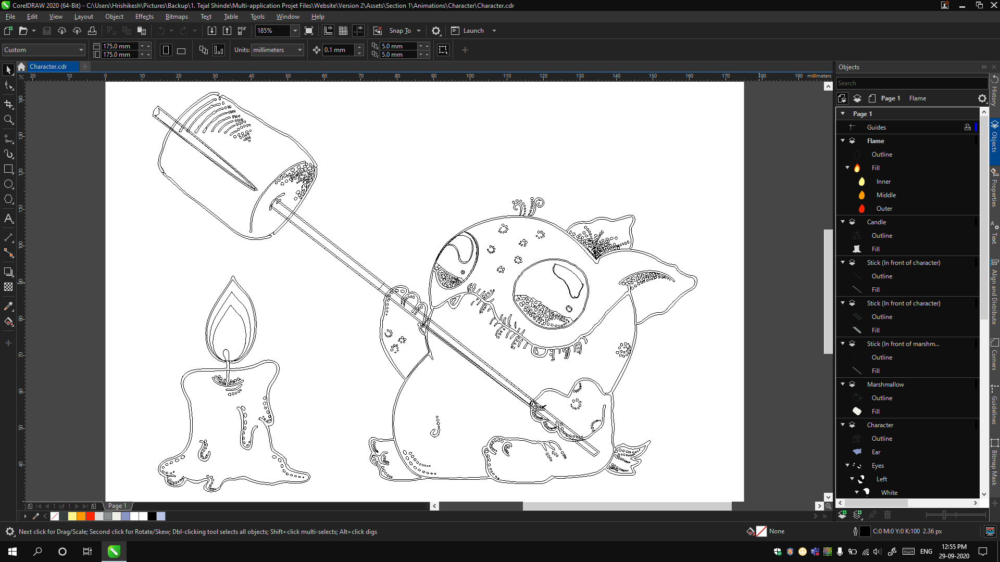
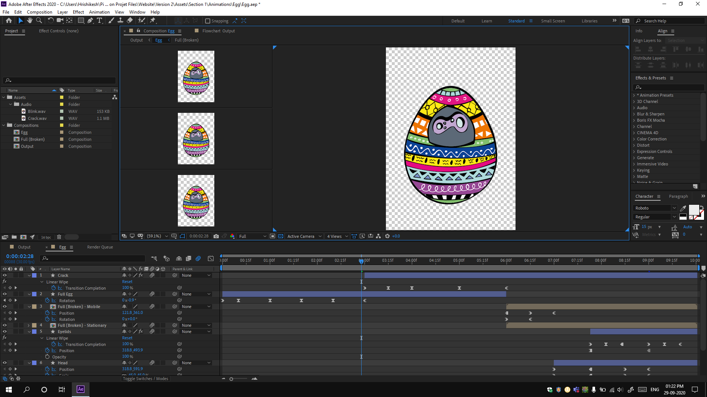

## Introduction

Traditional animation has been hand-painted. Even though in modern times, we do have applications, manually sketching each frame method doesn't really become obsolete. It's still needed and used. Applications have their set of limitations, but, in sketching, the only limit is your imagination and skill level. In the same lines, 'Animated Sketches' has been my first ever project that was initially sketched and then transformed into digital graphics. This project was brought to me by my friend [Tejal Shinde](https://www.instagram.com/thebubblebreaker_/). She's a graphic designer and an excellent artist. The sketches that I animated are her creations. This was a fairly simple project. It includes just 3 simple animations. However, the part where I had to trace her artworks in the applications was tougher than animation.

## Workflow

This project has got one of the simplest workflows as compared to all my other projects. The first step was to trace the image, then fill the colours and animate it. However, it's not as easy as it sounds. The sketches were made in 2018 and without any intention of animating them. So, when I got the images to trace, I was a bit worried about whether or not I'd be able to make it exactly like the sketch. But, I tried.

### Tracing

I chose CorelDRAW as my application to trace the sketches. It's a great vector graphics application with a super easy to use interface. However, there was a major problem in manual tracing. The hand-drawn outlines to the characters weren't even and evenly drawn outlines won't even look great in illustrations. So, I couldn't just draw the main shape and add a stroke to it. I had to manually trace both the sides of an outline. Then the hand-drawn dotted designs and textures take a lot of efforts to be traced in an application. Some stuff is just better to be hand-drawn after all.

Even after tracing was done, I had to prepare the file for animation. I needed to plan how I'm going to animate and break-down the artwork into different layers accordingly.

### Animation

After tracing and organizing was done, I imported the files in After Effects and converted them to native shape layers of After Effects. This gives a lot more control than importing external files. This does make After Effects file heavier and difficult to manage because of a lot of shapes and merge paths, but, to me, it's worth it. Then, I had to properly animate each required path, add effects and sync audio when required.

## End result

The videos were done in a matter of about 2 weeks. We both were happy with the result. Here are the videos:

### Video 1



### Video 2



### Video 3



## TL;DR

Animated sketches is a project brought to me by Tejal Shinde. It was her sketches that I had to manually trace and animate them. We made 3 short (10-sec) videos in a matter of about 2 weeks.