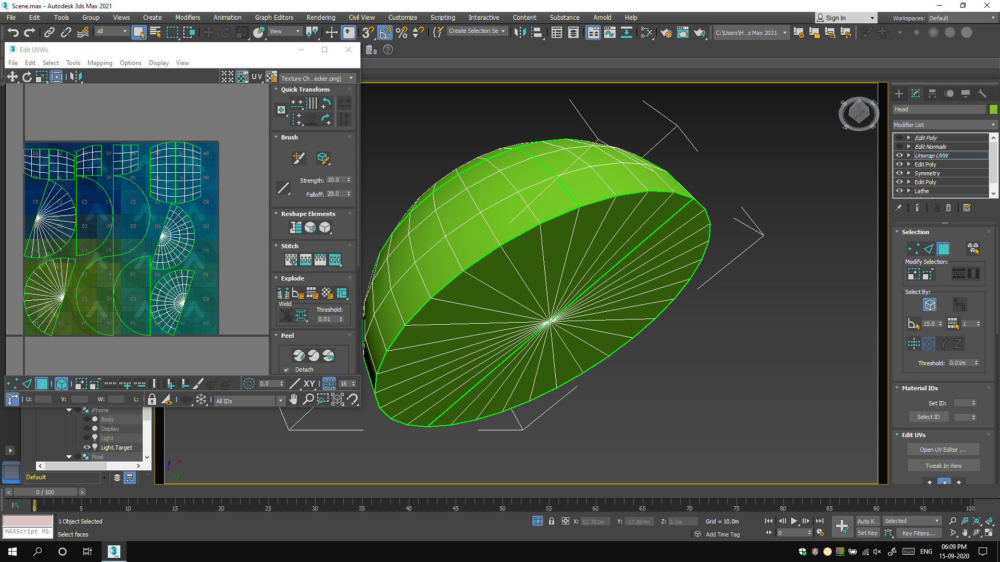
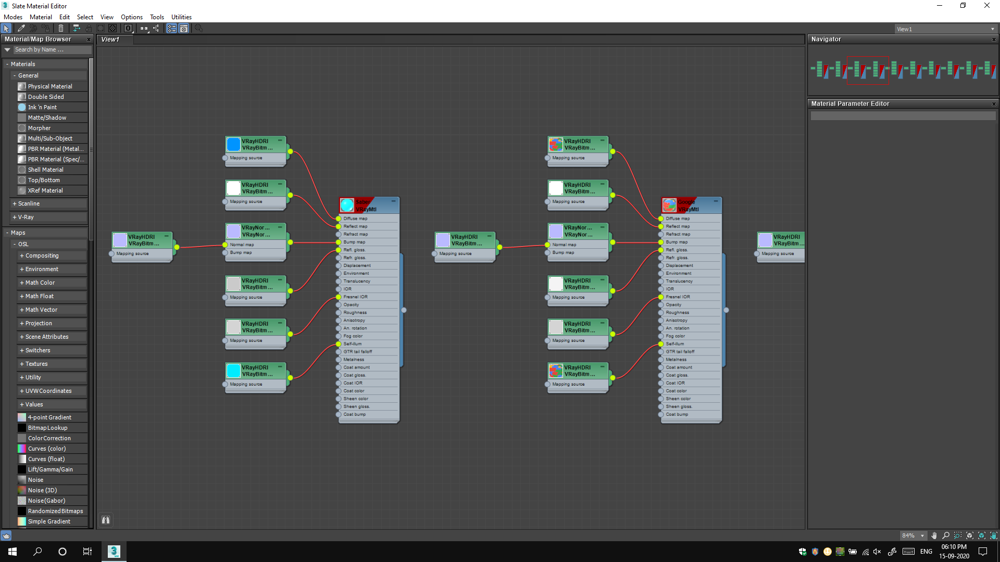
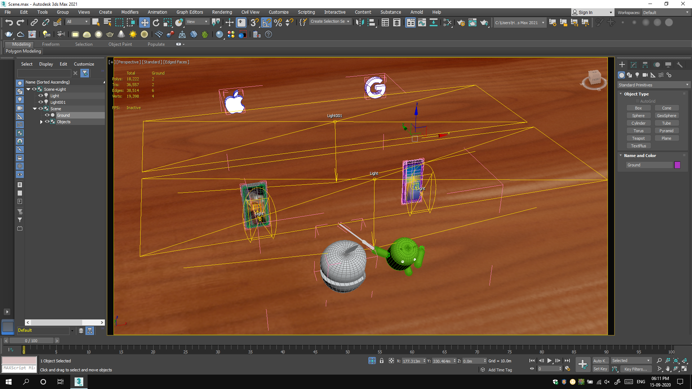
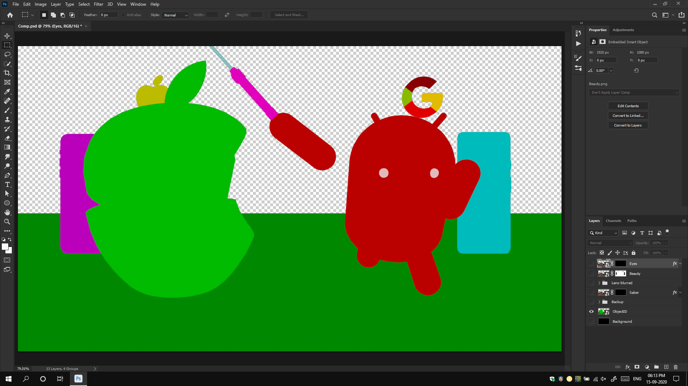

## Introduction

AniOS is my first ever project in 3D. Before this, I was just getting introduced to Autodesk 3ds Max by helping a group of friends complete their repetitive task of unwrapping their model using Box Mapping and then, texturing it using Substance Painter. But, I was taught exactly those limited steps that would help them get their result. Nevertheless, it didn't stop me from starting to explore the world of 3D and with my very limited knowledge, I jumped on to create this artwork. I had got the inspiration for this from an image I had seen online once and it was fit in my head, so, I thought, this was the best way to actually try to make something in 3D. To cut short, this project was fun, but, an overcomplicated blunder.

## Workflow

This might turn out as a joke actually. Since I had no real knowledge about 3D workflows and I was just repeating the steps that I was taught, I have actually messed up in this project. One thing was easy though since I didn't really know any other 3D application other than 3ds Max, I didn't have to do any elimination work. I had to work with it.

### Modelling & unwrapping

Well, it's understood by probably everyone, to work in 3D, you need a 3D model, to begin with. I have always lacked (great) modelling skills, but, this was the time when I had not even started learning to model. However, from some sources I had gathered information about the concept of modifiers in 3ds Max and anyone familiar with the application, would know what a blessing that feature is. So, I discovered a modifier called 'Lathe' and it basically, converts a simple 2D curve to a 3D object by revolving around its axis. I was familiar with CorelDRAW - a vector graphics editor and so, making the curves of Android and iOS (Apple) logos, wasn't a big task. I quickly created the required curves and imported them in 3ds Max as Adobe Illustrator files. Now, I had stepped out of my 2D comfort zone and entered into actual 3D work.

I began by applying Lathe modifier but it wasn't a smooth process. I had absolutely no idea how to control the parameters to get the required results. But I carried on by the legendary trial and error method. I was seeing some polygons black, some overlapping and what not. I kept searching and also asked my colleague [Soham Baviskar](ext:https://www.instagram.com/soham_baviskar/) for help who had started learning 3ds Max a few weeks back. In the end, I somehow managed to make models that seemed like Android and Apple logos.

Modelling is followed by unwrapping and it's considered a boring task. Well, now I know, back then, I didn't. For me, it was a 2-click job. Just apply a kind of mapping and you're done. The result well was something like the following image. But who cared? It was going in Substance Painter for texturing, so, any unwrap works (NO, IT DOESN'T).

### Texturing

I was limited by the knowledge that was given to me. All I knew was, after unwrapping is done, export the object as OBJ and import it into Substance Painter, export the maps, and import it back in your application. Now, if you've already seen the final image [(tap here, if you haven't)](anc:#end-result), and if you know a little about 3D, you would easily ask that why did I even need Substance Painter for this?! Well, at the time of writing this (it's being written in 2020), I won't even try to justify myself as even I agree, Substance Painter was overkill for this project. But, in 2018 I just went ahead, exporting each piece individually into the texturing suite and brought back about 5 to 6 maps for each. Yes! For each! So, for this simple project, I have around 50 images being used as maps.

### Lighting

The project that I helped my friends with was being done in V-Ray, so, now, it goes without saying that I ended up doing this in V-Ray too. I had learnt to export, import and connect V-Ray maps (even that is the wrong way), so, I did the same. As you can see in the image above, I attached all V-Ray maps and thus, had to light and render in V-Ray too. V-Ray is a great engine, but, again, it's an overkill for this project. I had no knowledge about lighting principles, or how to light. For me, it was like, if you want to darken an area, remove the light; if you want to lighten an area, add a light. So, I had a pretty basic light setup.

### Compositing

The render that came out looked pretty decent to me for my first try, but, it lacked the depth effect and glow on emissive objects. So, I had to turn to Photoshop for that. If only I had known the concept of passes, my work would have got a lot easier and better. Nevertheless, I knew about Object ID pass and I used that to make selections. I added glow to the company logos in the back, lightsabre and eyes of Android and added a simple blur to the background.

## Challenges faced

As I'm saying from the beginning of this write-up, I was completely new to 3D. So, I'd say, the biggest challenge for me was to work in a non-familiar workflow. The second biggest hurdle was posing. The Android logo that I made through Lathe wasn't made in this pose directly. It was made like the original logo. So, I needed to rig it first to make a simple pose. I watched videos and read forums and found out a simple non-bone based rigging method for the project using Forward Kinematics only. I have just parented the objects to some Empties and that's about it. The rest of the project went fairly smooth.

## End result

This project took me around 2 to 3 days to finish. I was very happy to complete my first ever 3D project and the result was eye-pleasing. Here it is:

## TL;DR

AniOS is my first ever 3D project that I did even before formally learning 3D. I did it with my limited knowledge and thus, ended up creating a messy workflow. Most of the work I did was overkill for the project, but, after 2 to 3 days of working, I got a nice render.