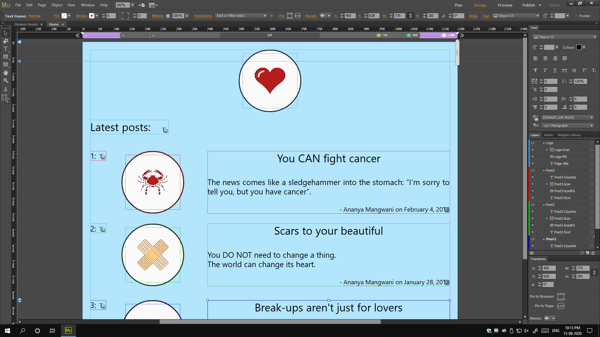
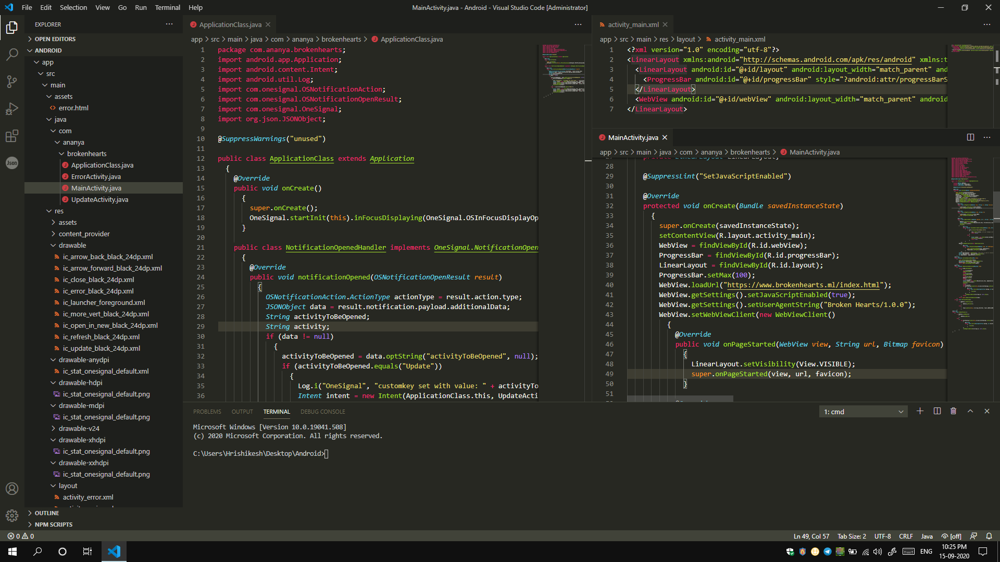
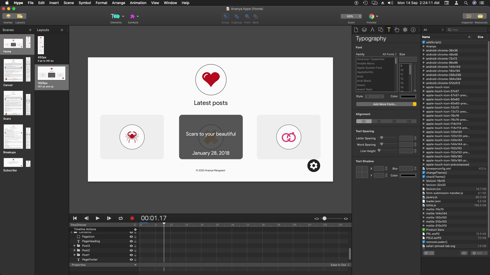
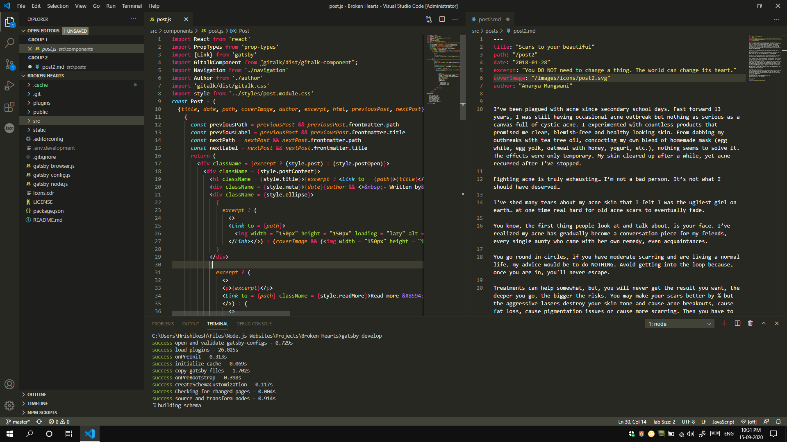
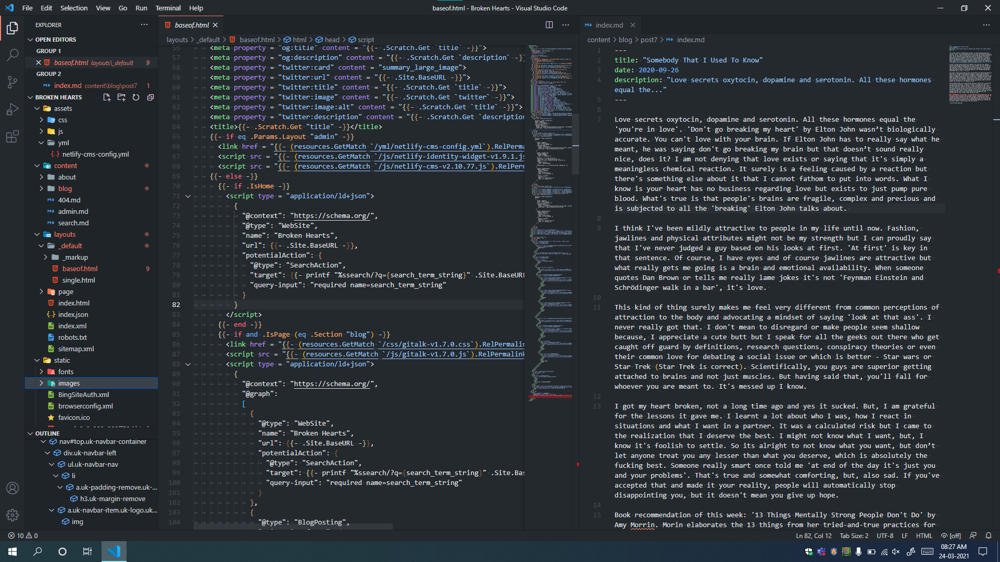
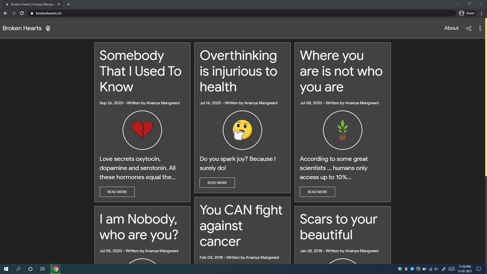

## Introduction

Broken Hearts is a blog I made for my friend [Ananya Mangwani](https://www.instagram.com/mangwaniananya/). It was a project I took up to learn and sharpen my web-development skills a little. It was back in 2018 when Ananya posted on her Instagram, the link to her blog on WordPress. The design was so basic and the URL went on like some weird address, that I offered to redo the blog as I knew I could do better than that. The best part was that she agreed to let me do it. Thus, my journey began.

## The journey

The website was going to be a blog, so, the most basic thing that was needed was something to make each page look same, just like master pages. Manually writing the same HTML for each page would have been very cumbersome, even though, there were just 3 posts back then. Also, my web-development skills weren't very great back then. I just knew HTML and basics of CSS. JavaScript was out of scope and it would be a surprise if a website claims it doesn't use any JavaScript.

### v1.0 - Adobe Muse

Actually, I had offered to make the website only because I was recently acquainted with Adobe Muse. It was a static website generator from Adobe that was super easy. It made making static, responsive websites a breeze. Add some text here, an image there, choose properties, configure its scaling based on responsive breakpoints and you were done. It was dead simple. So, I started working in Muse.

Her WordPress website, as I said before, had a pretty basic layout. Sadly, the website doesn't exist anymore and I don't have any screenshots, but, it was basically black text on a white background and each article was one below the other, continuously. To me, that layout didn't make a lot of sense. I decided that like most blogs, it should have a page that would display the posts and a different page for the actual post. It did make a lot more sense to me, but then, it was still going to be just text, text and text. I decided to change that and introduced icons. Also, not just post icons, but, I also needed a website icon (favicon). So, I turned to Photoshop with my little editing skills, ripped off some images from the internet that made the most sense with the title of the post, edited them to make the same size and style and I was done. 3 icons for posts and 1 for the website, didn't really take long.

It's definitely not the best layout you might have seen for a blog, but it did the job of organizing and displaying the content. It still needed a lot of manual work, that is to resize objects at different breakpoints, re-arrange them and most importantly, I was going to have to re-arrange it all for each new post. Coincidentally, she didn't want to post anything till the website was in Muse (and even beyond, for about 2 years!). So, it was more like a free website for me to experiment with.

The domain for the website was acquired on [Freenom](https://www.freendom.com/). It gives free domains ending with some specific TLDs. The website used [Cloudflare](https://www.cloudflare.com/) (for SSL) and was hosted on [InfinityFree](https://www.infinityfree.net/) (yeah, a free PHP server for a static website, let's talk about overkill).

Soon enough after the website was all done, I thought of turning it into an Android app. It wasn't a fancy one, it just loaded the website inside an app, so, it got its own interface, theme, and best of all, push notification on new posts. I had also successfully integrated Firebase Crashlytics in it. I used Android Studio and it was an amazing experience. It was basically my first time ever writing some real code. Yeah, I said, in the beginning, I didn't know much, and so, I can't take the complete credits for the code. I read the official Android documentation a bit, watched a lot of YouTube and posted on a lot of forums. But thanks to this, I got some real (however little) experience in 'programming'.

The screenshot is taken in 2020, while the app was made in 2018. I don't develop Android apps anymore and so, I don't use Android Studio too. Installing, setting it up and loading a 2+-year-old project in it without expecting a lot of errors would be a joke, and all that for just a screenshot? Haha, no thank you. So, that screenshot is from VSCode, my current development environment.

However, the app wasn't published on Google Play Store. It needed a one-time developer fee of $25. Sigh! This was the first version of the website, I had never really expected that I'd have to develop any more 'versions', but...

### v2.0 & v3.0 - Tumult Hype

#### v2.0

...I just visited Adobe Muse forum and saw a pinned post. Adobe had released an EOL (End Of License) announcement for Muse. I was devastated, much like many people who had commented. People were cursing Adobe, asking for alternatives and what not. Even I was shocked. I didn't know what to do. Did it mean the end of the website? Well, now we know it didn't, but, it was tough back then. I immediately started looking for alternatives, and tried a lot, but, honestly, none appealed to me as much as Adobe Muse did. It was dead simple and the websites produced in it were easily and readily responsive and even full-width. Adobe Muse had such an impact on me that even if today someone tells me to switch to a GUI based web development workflow that's as good, I'd gladly do it. But enough about Adobe Muse. After searching a lot, I came across Tumult Hype and it immediately caught my attention. I decided to try it out. To those who don't know, Tumult Hype is an HTML5 animation application by Tumult. It calls it an HTML5 animation app, but, it works entirely on JavaScript. Yeah, you can use CSS to style your stuff, but, the app uses JavaScript out of the box. But, it didn't matter to me back then. All I could see was it can produce something that looks like a website.

At first, I replicated the look of the website from Muse, but, changed the blue background to white and tried giving it a more modern look. I took some inspiration from Material Design, used shadows and on hover effects, transitions, etc. This new platform gave me some insights into JavaScript. I had to use it to manipulate DOM (Document Object Model) in a way that wasn't natively supported in Hype. Sadly, I don't have the old file anymore as I overwrote it with a new one. But version 2 was basically a transition and revamp from Muse to Hype. There were problems with Hype though. As I had mentioned before, it works entirely in JavaScript. So, the only output it produces is a JavaScript file that uses its runtime library. So, it wasn't SEO friendly as no text or images were rendered using HTML. The app isn't great to make responsive layouts either. We need to manually recreate the entire layout with all animations in responsive layout mode.

A few months after version 2 was developed, the domain on Freenom expired and it had stopped allowing any more renewals. So, to me, it seemed like a dead end. I had stopped the further development of the website. Since the website was dead, the Android app had been killed too.

#### v3.0

However, almost a year later, Ananya asked me why the blog wasn't working. I told her the reason and she said, she needed it for some project at her college. So, I reopened the archived project, but, it was too complex and cluttered to figure out as I had made it when I was beginning to learn Hype. So I decided to just restart from scratch as my improved skills would have made that process faster.

The new website did not just come with a new design, it also came with some latest web-standards like support for PWA using `sw.js` and auto dark/light mode. I had officially moved from using cookies to store preferences to `localStorage`.

The good thing about making this website a PWA was that a native Android (or for any other OS) wasn't needed. Users could just install it as a standalone app anyways. That was just a cherry on top of other benefits like caching and offline page offered by an `sw.js`. This version also introduced the move to Netlify to host the website.

### v4.0 Gatsby

The move to [Gatsby](https://www.gatsbyjs.com/) was revolutionary. It opened up so many more possibilities! Finally, the static blog started seeming not so static. RSS Feed, Site Search and Comments gave the website a complete dynamic feel.

I had just begun developing in Gatsby. I was amazed by the features and extensibility it offered. The website I was working on was almost done and so, I thought, I could use the same code (with some style modifications) to generate this website. Thus, I began to make changes.

I switched to a grid-based layout instead of a list based one that the original website had. Then I added some features like Site Search and RSS also. Another big revolution occurred when I could successfully introduce comments in the blog. That bridged almost all the gaps between a dynamic and a static blog.

I don't need to mention how great the Jamstack already is. Gatsby makes sure the generated websites are fast and heavily optimised. Node Modules help us extend functionality in unbelievable ways. Thanks to GraphQL and Remark, writing posts was handled by Markdown. This was also the first time ever that I also started using Git.

### v5.0 Hugo

Gatsby was great and it did an amazing job at generating the website. However, I had started questioning the concept of Node Modules. So many dependencies, such long download times, then the NPM goes down sometimes and what not. Also, bigger security concern is that, when downloading so many dependencies, who knows what those files are doing on your system. Lastly, these dependencies would be updated frequently and upgrading them would cause something or the other to break, thus countless more hours for debugging and it also used to happen that the developer of the dependencies suddenly stops trying to keep the project alive. There might be more problems, but I think you get the point.

I wasn't questioning this before, but something happened while I was trying to develop this website of mine - I discovered [Hugo](https://www.gohugo.io/). It's a static website generator written in Golang. The benefits, you ask? Firstly, it's a single binary download, that is around 25 MB from GitHub, and around 170 MB when unzipped. Then, the website is written in simple HTML, CSS, JS which makes is really easy to actually develop and maintain for my skill level. Lastly, it's extremely fast at building websites and we're talking about speeds in 2-digit millisecond values.

Even then, I was sceptical about making the switch as the Gatsby website was still working fine. But then, I thought of giving Ananya the ease of using a CMS like she did when she had her blog on WordPress. Thus, I introduced Netlify CMS to this website. Now, her blog can be managed by herself while the code does the work automatically. Apart from that major improvement, I had also come across [UIkit](https://getuikit.com/) - an excellent front-end framework. Thus, I could further optimise the styles of that Gatsby website and make it look clean and consistent rather than the mess it was.

The actual development process in Hugo was a breeze, more because I had already experimented a lot in it for my own website. So, a lot of the logic was a simple copy-paste. I finished porting the entire website from Gatsby to Hugo with all the features, that is Pagination, RSS Feed, Comments, Search (improved), Netlify CMS (new), and others in a total of 15 hours. Yes, that's it, an entire blog-like static website all done in just 15 hours.

Thankfully, I discovered that Freenom was working again too, thus the blog now re-uses its custom domain.

## End result

Her blog is available at [brokenhearts.ml](https://www.brokenhearts.ml/). The entire website can be checked out there and I recommend that you do because she writes some amazing stuff there, but, here's a screenshot of the home page (at the time of writing):

## TL;DR

Broken Hearts is a blog written by Ananya Mangwani, developed by me. Over 2 years, the website was made from scratch 4 times, each time better than previous. The website also changed its domain name, features were added and so on. I had started in Adobe Muse, moved to Tumult Hype, Gatsby and now, finally, it's being maintained in Hugo.