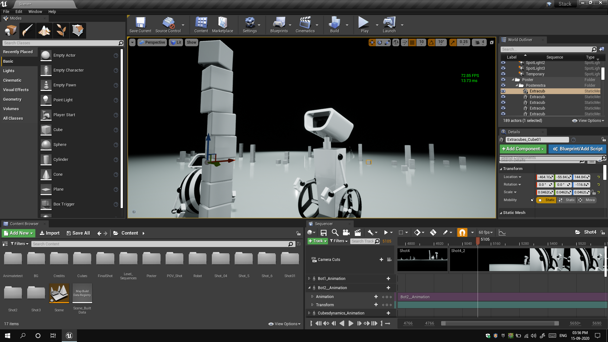
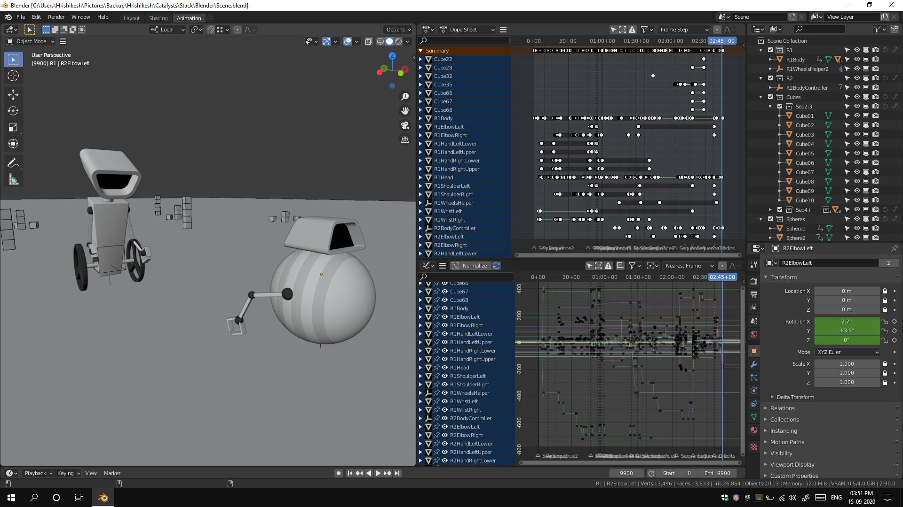
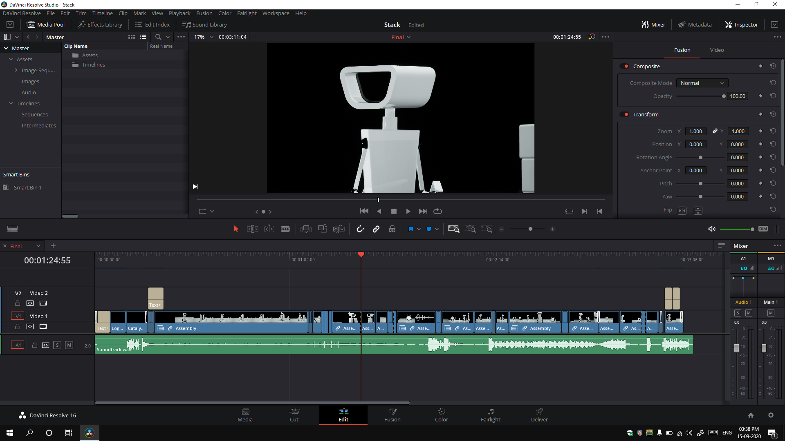
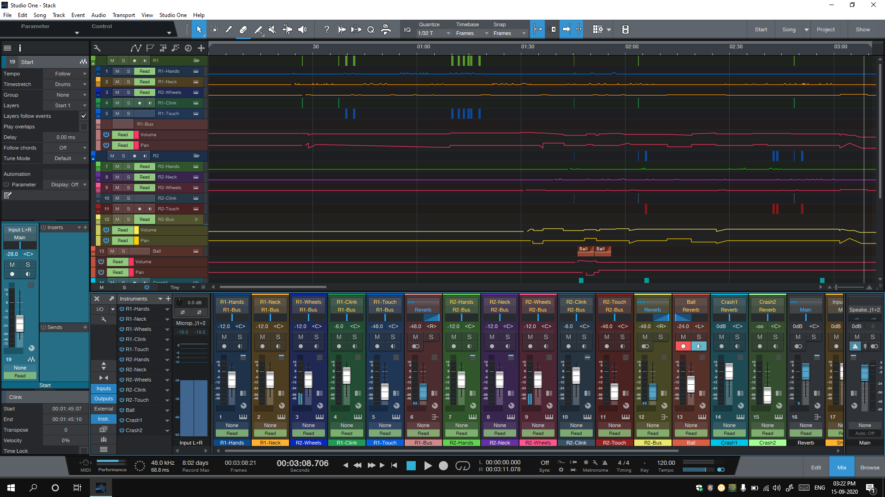

## Introduction

Carry on bot is one of my most ambitious projects ever. It's a 3D animated short film I made with my friend [Soham Baviskar](https://www.instagram.com/soham_baviskar/). The project took something around 3 months with a lot of time killed in between. With the completion and a successful release of the film, we had reached a new milestone in our skills level, work experience and confidence.

Soham initiated the project after he saw the video [Stack (YouTube)](https://www.youtube.com/watch?v=X9SzUlaH4L0). We both were doubtful if we'd even be able to make something like that. We saw a challenge in every second of the video. Be it the animation, showing expressions without a face, dynamics and even audio production, it all seemed tough and something that won't fall in our skill range. We were also limited by our hardware resources which are not very great, but they do the work. Since our last film [Goodbye Adam](/projects/goodbye-adam/), we had already hit the milestone of working in 4K UHD (2160p), and thus, returning from that path was not an option. All we could do was either maintain the level or increase it. So, that was another challenge as a film of 6 minutes in 4K quality would cost us a render time of months.

After thinking for a while and taking into consideration the clearly visible hurdles, we thought, let's just do it. The worst would be that we fail and not utter a word about it to anyone. Thankfully, we didn't have to see that side of the road. But the difficulty of this project went on multiplying as we went on working and at each hurdle, we thought that we can't do it, we should stop. But the voice in the back of the mind said that you've got it this far if you stop, all this goes to waste. That kept us going. I'd also like to take this space to brag about the fact that this film, just like Goodbye Adam, was made without a meeting, or even calling each other once. The entire discussions were just through WhatsApp texts, a feat, we think is not that easy to achieve.

## Choosing the workflow

After listing the challenges, we had to choose a workflow to go on with. This included our choice of applications to work in, the order of events and distribution of work. Soham has proved himself as a great 3D modeller, so, that work went to him without questions (however, the models in this film aren't the best of his works, they're probably the easiest). The animation was supposed to be my responsibility and for renders, it was going to be Soham. Finally, for editing and sound, the footages came back to me and we got our output.

### Choice of applications

Just like I have talked about in Goodbye Adam, we had to choose the right set of applications here too. It doesn't eliminate but it does reduce the chances of errors and challenges.

#### Unreal Engine 4.25

While we believe that choosing an application doesn't directly affect the work quality as long as the skill level remains the same, we had to choose applications that would work seamlessly with our pipeline. Since rendering time was one of our most important concern, we needed something that'd provide us with fast renders. Thus, we were considering Blender because of its EEVEE render engine, but then, we thought of doing it differently this time. Instead of using a traditional 3D application to render, we decided to go for a game engine. That won't just provide us with fast renders, but will also give some additions to our skill-set. We saw many videos on YouTube that were made using Unreal Engine and Soham already had some experience using it for some of his works. Thus, we decided to go with that. Honestly, I can't say it was the best decision as this step also came with a lot of challenges [(discussed below)](#challenges-faced), but, it's all past now.

#### Blender 2.9

After finalizing our rendering engine, we had to decide on an application that would play nicely with it. We knew that ABC files would take care of properly baked animations, but, the choice of application to animate in is what mattered now. In our previous experience (Goodbye Adam), we had worked in Blender and let's just say, we didn't find it as good as it's talked about. Maybe we were doing it wrong, but, from whatever we did, it wasn't a smooth experience. Also, we had another (unreleased and shelved) film that we were working on in Blender and the quality of dynamics we got in that was pathetic. So, since we needed dynamics this time too, we thought, maybe, Blender wasn't the correct option. So, we thought of choosing one of the most popular applications, Autodesk Maya 2020. We rigged both the characters and started test animation. This was very rough as the primary motive was to test importing and rendering with Unreal Engine. We exported out some FBX and ABC, but, oh boy, it was such a failure. The model came out broken, parenting was lost and whatnot. We tried various settings, various other options, but, seems like Maya and Unreal Engine didn't want to play along with each other, because, the ABC was importing fine in Blender. So, we decided, just to experiment, let's try animation in Blender. To our surprise, that worked well in Unreal Engine. It imported perfectly and played perfectly. We did some more tests with dynamics and that went smoothly too. So, we were forced to stick with Blender this time and we did face some challenges again.

#### Blackmagic Design DaVinci Resolve 16

After all the 3D stuff, we needed something to edit the renders. We've always used Adobe Premiere Pro in the past, but, this time, we wanted it to be different, more because we were hearing a lot about how fast and beautiful Resolve 16 is. So, we thought, yeah sure, why not? Like, how difficult can it be? We know some editing concepts from Premiere, just have to replicate them in Resolve. This was one stage that I'd say, there were no errors. Resolve is buttery smooth, has a lot of features like Fusion and Fairlight integrated and seemed fast overall.

#### PreSonus Studio One 5

Resolve is a fairly advanced application and its Fairlight Utility is not much less than an actual DAW. However, it did lack some features to properly automate sounds from VST instruments. Moreover, 4K 60FPS footage along with lots of audio tracks would have got too heavy for our systems to handle. So, it was better to switch to a different application for audio. But, why Studio One? Honestly, no specific reason. It was the first time anyways that we were using an actual DAW, so, it didn't really matter which software we chose. We tried Ableton and FL Studio, but, felt more comfortable with Studio One. Then, we used Boom Library Turbine for all the mechanical sounds. The start of the audio work felt like it's not going to happen, but, we kept ongoing. The constant drill-like sound started to hurt the ears, but, we were super close to complete the film and there was no turning back. After all the mechanical sounds were done, we started searching for samples to use for other diegetic sounds. They were not easy and we had to manipulate them heavily inside Studio One. After all these sounds were done, we worked on mixing and mastering the volume levels and panning of audio according to the camera position. In the end, we had to add music. First, we thought, we'd get away with Non-Copyright Music from YouTube, but, we didn't find any that went along with the video that well. Thus, we ended up composing a little bit ourselves.

## Challenges faced

No new experiment comes without any challenges, and so, this got its own set too. From rigging the characters to importing them in Unreal Engine and even during the final export, we faced some issues. Nevertheless, it was a great learning opportunity as we had to brainstorm and find workarounds or try and troubleshoot the root cause.

### Rigging and animating in Blender

We honestly still don't know how rigging in Blender works. From what we have figured out after multiple attempts and projects is that, it doesn't follow the conventional (the one that we have learnt in Autodesk 3ds Max and Maya) Parent/Constraint-based rigging. To rig anything in Blender, we need to use bones and even that seems to have a different structure. All in all, it was super difficult to get the rig correct, even though, just a day before, we had perfected the rig in Maya.

Even after the rig was done, the process didn't go smoothly. While animating too, we got some glitches, really weird glitches. Some objects would randomly snap to some position, others would rotate weirdly when rotated using trackball system and whatnot. From this, we learnt that, if we have to animate anything else in Blender, we need to figure out the Blender style of rigging.

### Rendering in Unreal Engine

Unreal Engine is great and all, but, just like all applications, it comes with its set of problems. We probably did it wrong, but, from all the forum posts that we referred to and from all the documentation pages that we read, it didn't seem like we were doing it wrong. The entire film is filled with weird render artefacts and lights are twinkling. We tried our best to minimise the effect, but, it's still there. Manually fixing each frame was out of the question.

### Exporting from DaVinci Resolve

This one is funny. We rendered the film multiple times to test and perfect and it worked fine every time, except, for the final render. On exactly 2 frames, we saw some weird artefacts, however, the artefacts were not visible in the timeline. We tried another render with some different settings, but, the problem still existed. We were worried now and finally thought of fixing the error by adding some black patches on the artefacts (as the background was pure black and it was just one 2 frames). Thus, we imported the video in Adobe Premiere Pro and to our surprise, the error didn't show up in Premiere either. We were and still are super confused. But then, we just re-exported it from Premiere and here we are.

## End result

One thing which we were worried about was personal satisfaction after completing the project and I can proudly say, we're highly satisfied with the output. Here's the end result:



The movie has a simple plot. A self-balancing robot finds itself a new and unique hobby. However, the other robot doesn't want to let him enjoy it.

## TL;DR

Carry on bot was one of the most ambitious project ever. It took me and Soham Baviskar around 3 months of work with a lot of tests, experiments, failures and whatnot. We researched our way into the project, from choosing the correct applications, to try to solve the problems we faced. All in all, it was a great experience and we hit a new milestone of making a 4K (2160p) 60FPS video.

## Credits

As mentioned above, I and Soham Baviskar worked on the project, but, here's the complete breakdown:

Modelling (+ Texturing), Lighting (and Rendering) is done by Soham Baviskar.\
Rigging, Animation, Editing and Sound is done by me.