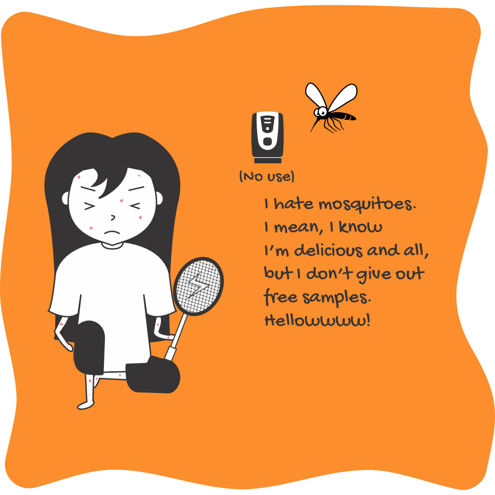

## Introduction

Daily Drama is a small collection of short comics on the life of a typical middle-class Indian girl. This project was brought to me by my friend [Tejal Shinde](ext:https://www.instagram.com/thebubblebreaker_/). It's her who did all the thinking, and designing, while I handled the technical department of actually producing the digital art. This was a very short project and hardly took us a week, but was a new experience. I had never made comics before, so the journey was indeed interesting. The comics are named Daily Drama because they tell stories of very basic problems in the girl's daily life, which some people might term as drama.

## The journey

As I already mentioned, this was a fairly small and not-so-complicated project. Thus, it did not require a very complicated workflow. Tejal thought of and sketched the comics roughly to show how she wanted the pose, the background, and the overall look. She also wrote the dialogues. I then had to edit the base figure that I had prepared to match the sketches.

### The base pose

The base pose that I've talked about above, was made in CorelDRAW, just like the rest of the comic. It was made as a simple A-pose figure with all major body parts separate, which can later be edited. The naming of all the parts was very important so that I don't get confused while working.

The base pose was just the first basic step. The real struggle was to edit the exact thing to fit in other poses. Since I was not using any live-sketching tools, I had to rely completely on curve editing. Yes, it was cumbersome, but the result looked great according to us. The choice of keeping the girl completely black and white is purely artistic.

## End result

In total, we made 6 comics and a total of 20 slides.

### Comic 1

It tells the story of the struggles of having a sore throat. Even a soup isn't able to fix it.



### Comic 2

It shows the (love) relationship between the girl and her quilt.



### Comic 3

It portrays the 'swag' of today's generation. However, when it comes to real life, the 'swag' disappears.



### Comic 4

It shows how easily fitness goals can be crushed.



### Comic 5

It shows the struggle between actually having a productive day and just thinking about it.



### Comic 6

It says the being too sweet can be injurious to health (featuring mosquitoes).

## TL;DR

Daily Drama was a short, but fun project, thanks to Tejal Shinde. It was the first time I got to create comics and even though the project ended soon, I did get some new experience and exposure.