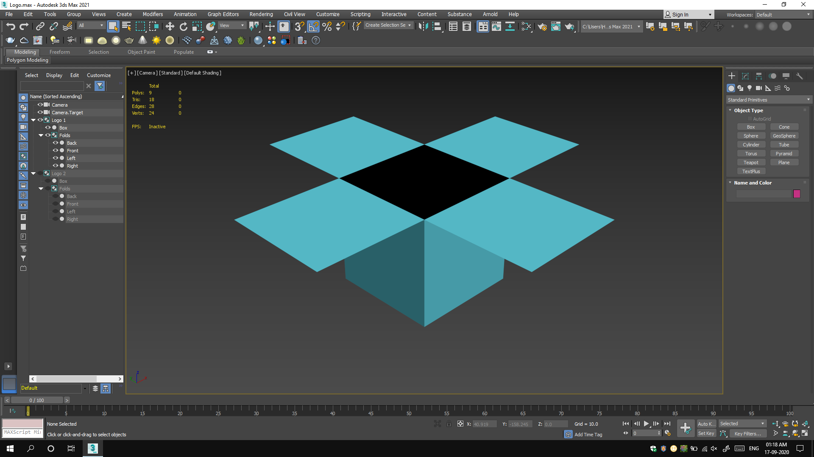
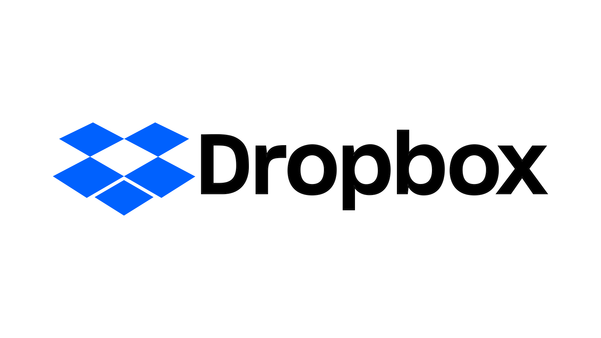

## Introduction

Dropbox has held the 'most ambitious solo project ever' title for me to date. It's so because it's been one of the most difficult projects to ever finish and it needed me to show my versatility with computers. It was assigned as a semester 4 project during my graduation. The project was to choose any company and create an entire advertising campaign for it, from scratch. However, what I did wasn't really expected, but, I thought, why not? We were asked simple designs and ideas, but, I went ahead and showed the ideas implemented in real-life mock-ups. We'll see about it. The project took around 3 months to complete with a lot of other stuff to manage too. At first, the project seemed almost impossible and I had no idea how I was going to go about it. But after a lot, like a really lot of efforts, it was done and well received by others.

## The task

We had to start by choosing any company and then make:

1. Logo (following the Just Noticeable Difference principle) × 2
1. Envelope × 2
1. Letterhead × 2
1. Visiting card (Front & Back) × 2
1. Magazine ad: B/W × 1; Colour × 1
1. Newspaper ad: B/W × 1; Colour × 1
1. Television ad (with storyboard) × 2
1. Radio ad × 2
1. E-mail newsletter × 2
1. SMS ad × 2
1. Point Of Purchase ad × 2
1. Out Of Home ad × 2
1. Website (Home page) × 2

This was scary as I had never done anything of this sort before and I wasn't even sure if I'll be able to think all of it. But, a task is a task, I had no choice. I began working.

## The journey

### Choosing the company

The first two weeks or passed just thinking for a suitable company to work on. Even though this project was tough, I wanted it to be the best. I spent time studying the logo making process of many companies, how they made the logo they're using now, what was the thought and idea behind it. The idea was all that mattered as I wasn't limited for the most part on the technical basis. I trusted myself that no matter what I think, I'd pull that off in some of the other application in some or the other way. So, I put a lot of time to think.

After reading about a lot of logos, I had figured out that the companies have already put a lot of thought into their logos. Each of those had a story, months of research and whatnot. The JND principle had also restricted the changes to be too drastic. But, I was lucky. In a random Google search, I saw the logo of Dropbox. It quickly caught my eye because I noticed something interesting in it. Me being from a 3D background found the isometric geometry quite unappealing. I quickly searched more about that logo and found out that there wasn't any big story (at least not publicly available) behind that logo. So, I considered starting with the company. I wondered if I'd be able to make an entire project on that company though. For those who don't know, [Dropbox](https://www.dropbox.com/) is a cloud-storage service by an independent company. So, the requirements of the project down the line like OOH ads or radio ads weren't really clicking at that instant. I still took some time to think about it because if I go too ahead, I might not have time to restart from scratch. But time was ticking out, so, I thought, let's just do it.

### Redesigning the logo

As I said before, I chose this company just because the isometric logo was quite unappealing to me. So, obviously, the first idea was to create a perspective version of it. Just to be geometrically accurate (as that's what I'm targeting after all), I decided to actually make the logo in a 3D application, not like it was going to take up a lot of time.

The logo was then exported to CorelDRAW for 'vectorization' of it and to make an actual 2D version. I decided to keep the fonts and colours the same as the original. I even kept the position of the icon and the typeface same as that of the original. But, that resulted in a logo that I'm myself not a big fan of.

Now I had realised why the company might have gone with an isometric logo. Well, I decided to move on and correct this one as a second variation. Luckily, I could easily figure out what's wrong. The flaps of the box! No box has all 4 flaps that overlap each other completely. So, I went ahead and gave it the feel of a real 'box'.

This one looked much better, cleaner and minimalistic - just like the trends. I even reduced the gap between the front-flaps and the box below it. It gave it more of a 'box' feel that suits its name.

### Office stationery

I grouped the next 3 tasks, that is envelope, letterhead and visiting card into one because it's generally how a company has it all. One-unified theme with different content. So, I now had to design something that could seem right on all those 3 formats. I returned back to my logo concept for this. What is this company called? Dropbox. So, it's essentially wanting to show itself as a box. I had got my answer. I needed a design that would feature boxes.

* I create a boxy layout that would fit all 3 formats well. As a graphics designer, it was important for me to use properly sized pages. So, I made sure that I'm using a Letter-sized page for letterhead, DL size for envelope ad Business Card size for well, visiting cards. I used placeholders to fill data and then, created a 3D representation of it all. The designing part was done in CorelDRAW, while the 3D image was rendered using Blender.

* For the version 2 of the same thing, I decided to keep the boxy design idea but implement the boxes differently.



### Print ads

I grouped the next part, that is, magazine and newspaper ads under the same category 'Print ads'. This was for a reason. I decided to create advertisements as if they were being shown during a simple campaign. Basically, all the 4 ads will have the same central theme just like during a particular ad campaign. I chose technology magazines as my target to show the ads in. For magazine ads, I decided to go for half-page ads, while, for newspapers, I decided to go for a &frac18;th size ad.

The idea behind the ads was to show and highlight the most important features of Dropbox. The most primitive use case of cloud storage is to store files as a backup. So, I thought, why use the fear element and show files in danger?

As for the technical part, I created the ads in Blender. I textured and rendered the scene after adding lights. The magazine cover and pages were designed in Adobe InDesign and the scene was re-rendered in Blender.



### Television ads

Television ads were probably the toughest to think of and make. A cloud-storage company probably won't choose television as a medium to advertise itself. Nevertheless, I had to make those. So, I started looking for references, ideas, previous ads, but to none avail. Forget Dropbox, but no cloud storage service that I knew had any television ad history.

I decided to give this a try myself too. I listed out the features, use cases and benefits of Dropbox (or any generic cloud-storage for that matter). Cloud storage should be fast, secure, making sharing files easy, have some good collaboration tools, store almost any format and so on. I prepared two scripts and then wondered how to get it in action. I decided to rely entirely on animation. Since the first one didn't need any complex (character) animation, I made it in 3D while I made the other one in 2D.

The problem was, I needed voice-overs, but, I didn't have any voice-actors with me. So, I was forced to use Text To Speech. I got it recorded and started working on models. It wasn't overly complicated, but, still a little tough for my modelling skills. I made the models in 3ds max as that's my all-time go-to application for 3D models. I imported them to Blender and did the scene setup, texturing, lighting and rendering in it. But, before getting into animation, I had to make sure that my scene plays well and it was a part of the project anyways to make a storyboard. I don't have any great level of skills in sketching, so, I ended up using my 3D models to generate a storyboard in Toon Boom Storyboard Pro.



I made some changes to my original script after making the storyboard as I felt I had to. So, I remade the storyboard accordingly. I animated the scene according to the voice-over durations and finally edited it in Adobe Premiere Pro. It still missed something and that was background music. Though I'm not a music composer, I do compose some random tunes in random audio production apps. I used LMMS for this one. Here's the final video:



For the second video, I was going to need a little stylized animation, so I decided to go with 2D. I needed a storyboard again, so, I used a pre-rigged model from Mixamo and treated them in the same way as the previous one. The ad, however, is made in Adobe After Effects.



After editing and music, here's the final video:



### Radio ads

After completing the television ads, it felt like I had conquered the world. It felt like, the project was almost done, nothing could stop me and whatnot. But, radio ads weren't any easy. It's a medium that works only on audio, so, that's one big limitation. I heard some radio ads for this and consolidated the workflow to one important thing. Radio ads almost always are a conversation between multiple people. So, I did the same. Created a central theme for 2 ads, that is, people complaining and then the narrator giving solution. The voices are again managed by TTS and later pitch-shifted in Adobe Audition.

The first script is about students complaining to their teacher about not being able to receive notes that are being shared. Thus, the teacher is troubled.

Script 1:

>Student 1: Sir, I could not locate the notes that you shared.
>
>Student 2: Sir, the format of the notes was deemed incorrect.
>
>Student 3: I could not access the notes in their location.
>
>Student 4: The size of your notes was so huge that I couldn’t view it.
>
>Student 5: I didn’t receive any notes. Could you please resend them?
>
>Teacher: Should sending files in 21st century really be so difficult?
>
>Narrator: Tired of your students' complaints regarding notes? With Dropbox, drop your notes where students can access them easily. You get 100GB to start with for free! What are you waiting for then? Signup now and gather your team on dropbox.com.



The second script is about designer not being able to send designs to his/her client easily because of hassles in online file sharing.

Script 2:

>Client 1: I needed the drawings by yesterday! What are you still doing?
>
>Client 2: Now, should uploading your drawings take that long? You’re wasting my time.
>
>Client 3: I’m paying you for your job. Can’t you just be a little more professional?
>
>Client 4: Don’t bluff. You haven’t sent me any drawings yet.
>
>Client 5: I hope you remember we’ve a conference this evening. I don’t see your drawings anywhere.
>
>Narrator: Tired of your clients’ dissatisfaction regarding your work? With Dropbox, drop your work where clients can access it easily. You get 100GB to start with for free! What are you waiting for then? Signup now and gather your team on dropbox.com.



### E-mail newsletters

Making e-mail newsletters for a cloud-storage company was one of the easiest tasks for this project. We all get one from time to time. Almost all technology companies have two sales every year. "Black Friday" sale and "Cyber Monday" sale. But instead of making both of essentially the same concept, I thought, I can make one as a monthly newsletter that will show the latest features of the service. The making of the layout wasn't very easy though. I had to manually trace entire macOS e-mail UI in CorelDRAW, but, that gave it a better look than a normal image.



### SMS ads

SMS ads were the easiest of them all. Just had to fill 160 characters. Following the idea from the e-mail newsletter, I decided that one would follow the offer concept and others could go by inducing fear in readers' mind over losing their files.



### Point Of Purchase ads

The next in line was POP ads. Now, Dropbox is an online service, it doesn't really have its own places for POP ads. However, it can advertise itself in various other POP areas. I chose billing counters in malls as a POP site, because, people usually wait there for quite some time, look here and there and get bored and irritated. That would be the perfect place to target them with some relevant ads.

* The idea for my first POP ad was that a customer, instead of getting bored by just waiting in line, could stream his favourite movies or songs, if he/she would have synced it using Dropbox.

* The second ad uses the concept that stores sometimes give loyalty discounts to their customers if customers can provide them with old bills as proof of purchase. But, hardly, anyone maintains the bills. However, if the customer would use Dropbox, he/she can click photos and keep it synced.

Both the illustrations feature a QR code that will take the customers to the Dropbox website. It's intentional because people at POP are either in hurry or waiting, and in both cases, a QR code would do a job faster.

Both the illustrations are made in CorelDRAW, while, the scene is made in Blender.



### Out Of Home ads

For OOH ads, I targeted big billboards in metropolitan and corporate areas as that's where the people who would need cloud service the most, exist and commute daily. I decided to use that huge space to provide minimal but important information to attract attention. So, I designed the ads in such a way that would highlight the most important feature of file backup and sync and would also list the other features.

* The first ad shows a view from a plane. Now in many costly flights, we do have Wi-Fi connectivity, but, even in budget flights, we can still work offline using Dropbox. Thus, the caption 'Your files are ready when you are'.

* The second ad highlights that Dropbox can store all of your files in a safe place. It's trying to create a sense of trust and also indicates that it can backup almost all types of files. The background image depicts that it can be used in a work environment where people are busy and sharing files should not be a hassle.

Both the ads were made in Blender.



### Websites

This brings us to the last section of the project, however, an important one. This one wasn't very difficult though. I have been making websites some or the other way for a long time. So, I had some amount of confidence for this task already. I decided to go for a landing page approach with a big header image that would possibly be a vector, so, I could use `<svg>`. We just had to create the home page, so, I needed a home page that would highlight the most prominent features. So I decided to keep the features same, just different layout and cover image. I needed a quick output and responsiveness and SEO wasn't a requirement, so, I decided to make the website in Tumult Hype.

The first cover image is making use of the phrase 'Every cloud has a silver lining', however, the word cloud is now being used to define 'cloud-storage'. Thus, to set it apart from the competition, I have used, the 'only' cloud with a silver lining as the caption. For the remaining part, I've added some simple viewport animations to make the page look good enough.

* While presenting the project in college, I had served the website locally, but, in case you want to check it out (on my server), tap on the button below the image. None of the links in it is functional as it was just supposed to be a home page layout. The website isn't responsive either and it's tested only on a viewport-width of 1920px. [Check out the website here](assets/website1/).

* In the second ad, I'm using humour element to point out the fact that, even though we were expecting flying cars in this time range, we haven't got them. However, the users' files can 'fly' now because they're on 'cloud'. [Check out the website here](assets/website2/).

The cover images are made in CorelDRAW and the mock-up is made in Blender.



## Presenting the project

The project took about 3 months to finish and we had to present it in the form of a PowerPoint presentation. We were asked about our ideation and our workflow, basically, a subset of what I've talked about here.

## TL;DR

Dropbox is probably the hardest solo project that I've ever worked on. It made me show my creative skills and versatility in using computers altogether. I had to create a lot of stuff that I've mentioned above. It was a task, but, a great learning experience overall.