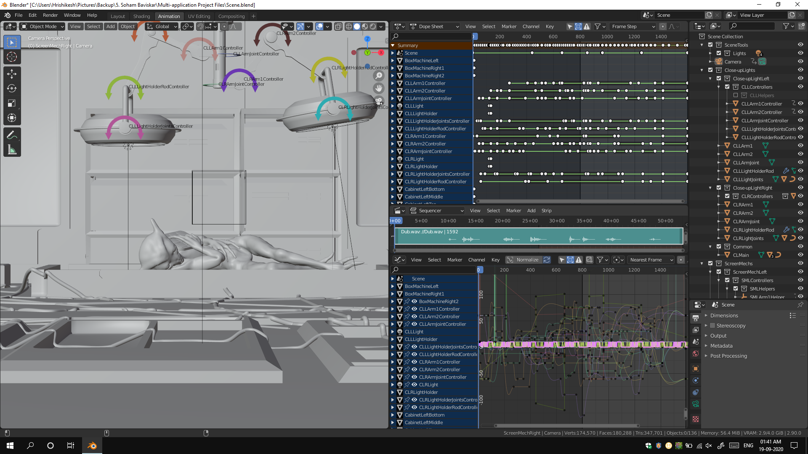
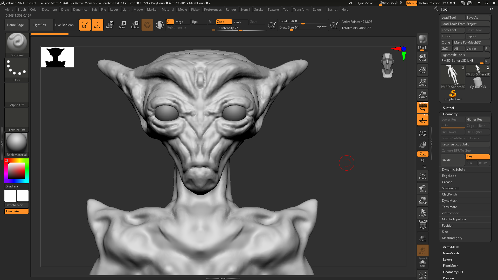
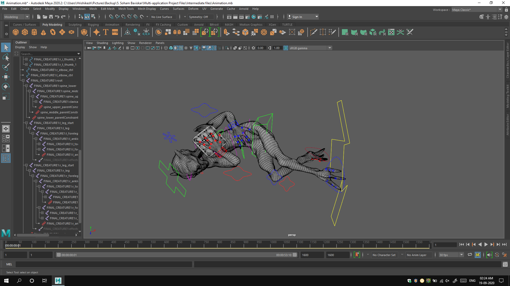
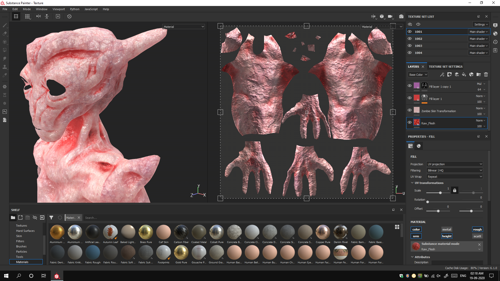
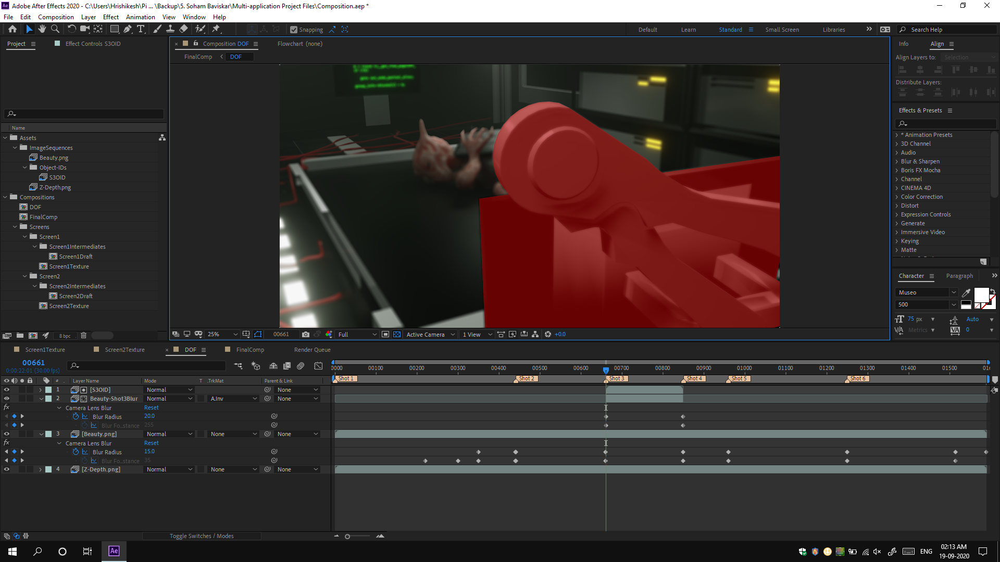
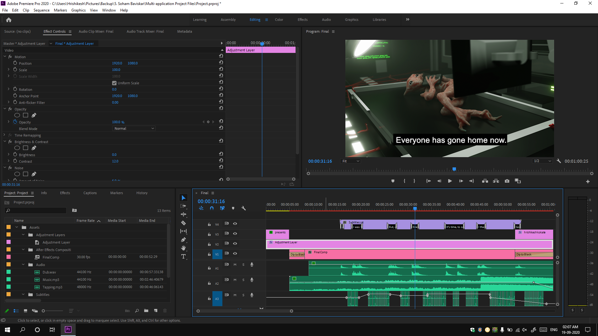

## Introduction

Goodbye Adam is my first ever project in its category. It's a 3D animated short film. I worked on this project with 2 of my friends, [Soham Baviskar](https://www.instagram.com/soham_baviskar/) and [Vaishnavi Madhavi](https://www.instagram.com/23.9.2k/). We worked on the film from our homes during the initial lockdown period in India caused due to COVID-19. It was supposed to be an experiment, a skill test, but the result stunned us as much as the audience. We didn't know if we were up for a challenge that big, but, we went ahead with it anyways.

Soham initiated the project after he saw the video [Goodnight Claire](https://www.youtube.com/watch?v=raaAf4M1BEo). Lockdown was new, we didn't have much work, so he was thrilled to take up a project of this level. He pitched the idea to us and after some discussions, we decided to go for it. We didn't know if we were going to be able to do it, but, we still decided to try.

After a lot of challenges and trials and errors, we did it. We made an actual 3D animated short film, that too in 4K nonetheless.

## Choosing the workflow

The original film was rendered using Blender's EEVEE render engine as a test. When we were working on it, EEVEE was released in the stable version of Blender. So, we thought, why not? We had worked in EEVEE before and we were impressed by its capabilities. We knew that it was faster than any render engine we knew during that time and it also gave good results. We were deciding on a rendering engine before starting to work because of the fact that we need to take it into consideration as our systems don't really support very heavy tasks. We could not spend months just to render.

### Choice of applications

>"A bad workman always blames his tools".

Probably, all of us have heard that famous saying and it is very true. Someone who can't work will always find a way to justify himself/herself by blaming someone/something else. Same is true for applications. Someone who can't produce good output using some application because of his/her skill limitation, he/she won't be able to produce good output in probably any other application unless the skill level increases. However, choosing the right application for the right purpose actually helps a lot. Read below to find out how.

#### Blender 2.8

As I have mentioned above, we first fixed our rendering engine. Since it was going to be EEEVEE, we had to do the final scene setup in Blender. So, why just render? Soham went ahead and modelled the entire scene in Blender itself. He also set-up the textures and did the lighting. However, the character wasn't modelled in Blender. But that's not the end of Blender. I further used it to rig and animate the mech parts. Another application just for that part seemed an overkill.

#### ZBrush 2020

Soham had stopped making characters from scratch in 3D modelling applications a long time ago. By now, he had got fairly acquainted and trained in ZBrush. He finds it way easier to sculpt a character. Thus, he chose to create the character sculpt in ZBrush.

#### Autodesk Maya 2020

Sculpted models aren't perfect. Their topology needs to be managed, they need to be edited further to be ready to use in production. Now, Soham could do that in Blender itself, however, the model was further going to need rigging and animation. Vaishnavi was responsible to do that. She wasn't familiar with Blender back then and beginning to learn it from scratch would have taken some time if not a lot. However, she's great at using Maya. So, the model was imported into Maya from ZBrush and processed there.

#### Substance Painter 2020

After the model was ready and unwrapped, it was getting textured on one side and rigged on the other. Soham chose to use Substance Painter for the character. He had gained quite some skill level in it. Thus, to give the slimy, shiny alien look, it didn't take him a lot of efforts in Substance Painter. It was like, he already knows his way through it.

#### Adobe After Effects 2020

We needed the code-type animation on the screens and it was easier to do it within After Effects than any other application. I did that after Soham gave me the UV layout of the screens. But, we needed After Effects even more as we went ahead. We had to do some colour correction and compositing within it. We wanted a nice Depth Of Field in our renders, however, for some reason, it was taking over half an hour per frame with DOF enabled to render. So, I pitched the idea of using Depth Pass and managing the DOF in post-production. Soham was unsure about it, but, I went ahead and rendered a frame and added the Lens Blur in Photoshop, just to try it once myself and give him an idea about it. The effect came out good. So, we decided to do it in After Effects. We also had to use the Object-ID pass, but more on that later.

#### Adobe Premiere Pro 2020

We had used After Effects, so, it goes without saying that the video editing application of choice, in this case, would be Premiere Pro, all thanks to the Adobe Dynamic Link connection. It saved us from a huge intermediate render time (and disk space) of rendering from After Effects just to import it later in Premiere Pro to edit. I also managed sound in the same application. I changed Soham's raw dub vocals by adding various equalizers and pitch shifters to get the sound we wanted. Finally, we also needed the super important reverb to add the complete effect. Premiere isn't as easy as any other audio application to manage the audio, but it does the job and we really didn't want to use another application just for audio. The music was taken from the no-copyright library of YouTube.

## Challenges faced

### Rigging in Blender

I am primarily a 3ds Max user but can use Maya too. The way I had learnt rigging in those 2 applications, didn't work in Blender at all. I took up the task of rigging the mechs thinking how hard could it be? I was thinking about 3ds Max way and it would have been really easy if I could have got to use those constraints and reaction manager. But, that would add another application to the list and the import/export problems would follow. So, I decided to stick with Blender itself somehow. From what I have figured out by now, Blender only works fine when using bones to rig. But, not every rig needs bones. We can get away with simple relations. Either I was doing it wrong or it just doesn't work in Blender. Any which ways, after a lot of trials and errors, I managed to set up a rig that works to some extent. It was a task though.

### Importing animation from Maya

We had not considered this problem. We had just thought it would simply work. We were aware of the FBX format and knew that it has options to send animation data too. But for some reasons, it wasn't working. We tried baking keyframe data to bones, deformations to mesh, but nothing worked. We were lost. But then, finally, I thought of giving ABC cache a try and that worked.

### Rendering

This was the aspect which we had expected to not give any issues, but, we were proved wrong. After exporting the entire PNG sequence over a week or a little more, we decided to watch the raw video to see how it looked. We imported the sequence in Premiere Pro. We couldn't really preview the sequence in the timeline so, we had to export a video. We were shocked to see some weird light flashes in random parts of the video. We don't have any idea of what they were or how they had appeared to date. Nevertheless, we had to find the problematic frames and re-render them individually. There were about 7 of them in the total render of about 1600 frames.

## End result

The entire film took about 1&frac12; months to complete. The journey included a lot of challenges along with a lot of learning experience and fun. Here's the end result:



The plot of the movie is that, when humans finally met aliens, all they did was capture it and run tests on it, until it was finally time to say a final goodbye.

## TL;DR

Goodbye Adam was the first-ever 3D animated short film I made with Soham Baviskar and Vaishnavi Madhavi. It was an amazing experience that spanned around 1&frac12; months. It came with a lot of challenges and learning experiences.

## Credits

Modelling (+ Unwrapping + Texturing), Lighting and Dubbing is done by Soham Baviskar.\
Character Rigging & Animation is done by Vaishnavi Madhavi.\
Mech Rigging & Animation, Compositing, HUD Animations, Video Editing (+ Audio Editing) and Subtitling is done by me.