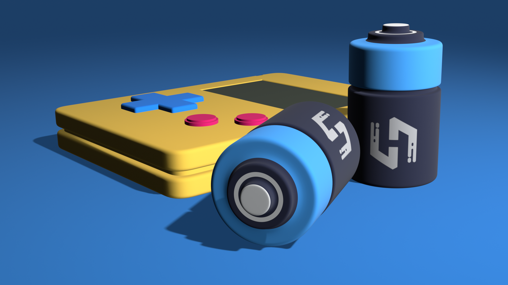
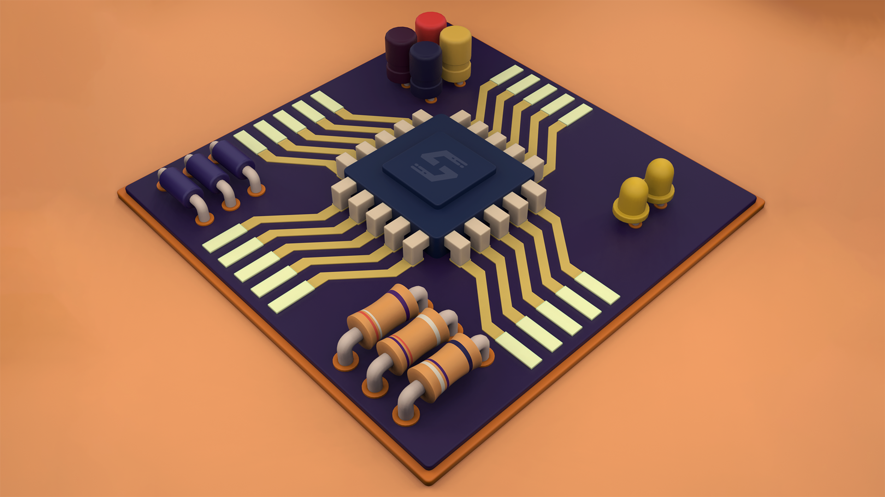

## Introduction

Stylized 3D is a self-assigned project. This was to improve my modelling skills. After trying and failing a lot of times in 3D modelling, I had realised, it's not something currently possible for me. But, I thought, I need not try to go for ultra-realistic, demi-Gods and whatnot that a lot of people make. They're amazing, no doubt and I do wish that I could make them, but, I need not give up modelling. I can model basic 3D objects. So, I turned my limitation to a strong point and started making stylized 3D models. I saw many people posting such models on social media, so, I thought, why not me too? The basic idea behind these models is to not target very high polygon count or realism, but, still produce a decent 3D render. The best part is that this project never gets over. Once in a while, I keep making another model, so, keep checking.

## Choice of applications

I had decided that I was going to render in Blender. It's hard to deny that fact that Blender has an amazing UI that's intuitive and super fun to use. We can produce some really good renders without a lot of efforts. Also, EEVEE does its job really well at rendering at a great speed. So, I can spend time on increasing render quality without waiting for a lot of time to render a single image. Plus, the real-time rendered viewport makes previewing the settings a breeze. So, yeah, I had decided to render in Blender without any questions, however, when it came to modelling, things took a turn.

### Autodesk 3ds Max 2021

Blender is amazing and all, but, I feel at home when modelling in 3ds Max. I just love its modifier stack concept. At my current stage of modelling, I tend to make a lot of mistakes, like, consider the proportions wrong, or extrude/bevel using less/more values than required. So, it happens a lot of times that I have run out of my undo history and I basically need to restart the model. 3ds Max lets me forget about undo history problem. I need to chamfer the edges? There's a modifier for that. I need to edit the model after adding chamfered edges, add edit poly modifier and continue. I messed up really bad and need to go back? Done, just delete edit poly modifier and I'm still left with my chamfered model. It just makes it so easy! And it's not just about modifiers. 3ds Max's align and snap options are just great. Overall, I find the applications super comfortable to use. So, I take my time and trial and errors to model in 3ds Max. I also unwrap the model if needed and once satisfied with the result, export it to Blender.

## Blender 2.9

I have talked about how Blender's good for the rendering part above. However, export/import sometimes doesn't go well. With that being said, even though I said above that lighting and all is easy in Blender, I try to spend some extra hours and trials and errors before finalizing my scene.

## Models

I keep adding more to the list. The list is sorted by date completed (descending). With each new model, I try to improvise than its previous one. It includes changing my modelling techniques, trying different textures, experimenting with colours, using HDRIs for lighting and so on. There's nothing much to say about each of them.

### Nintendo Gameboy

Completed: September 20, 2020\
Total time taken: ~ 6 hours

### Circuit Board

Completed: July 20, 2020\
Total time taken: ~ 18 hours

## TL;DR

Stylized 3D is a self-assigned task to practice and improve my modelling skills. Instead of failing to make some super realistic 3D models, I try to make simple low poly models and keep my confidence intact. I keep making one every now and then.