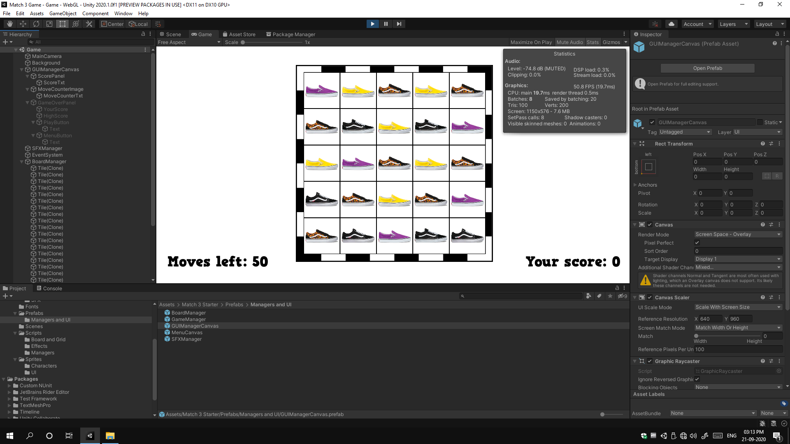

## Introduction

Vans Match-3 is a game created by me in Unity. It's a simple Match-3 game, where we have to match 3 or more tiles of the same image either vertically or horizontally. The game was created to aid my friend [Ananya Mangwani](https://www.instagram.com/mangwaniananya/) in one of her college projects where she had to advertise the brand Vans. I don't exactly know how this game was going to do it, but, that's what was asked out of me, so, I went ahead and made one. It was going to be a new thing for me too considering, I had never made a game before. The game was supposed to be playable on a webpage.

## The journey

Since the game was supposed to be run on a webpage, at first, I thought of making use of Vanilla JavaScript. I was sure that JavaScript of 2019 can be put together to make a simple working Match-3 game. However, my skills were limited. I found a few libraries that had experimented with creating such a game, but, I couldn't get them to work in my case. I needed the images to be of some specific shoes of Vans, however, either the tiles couldn't be configured to show images, or the game wasn't playable, and so on. Basically, that didn't work as expected.

I ended up telling Ananya that this won't be possible for me. But, shortly after, I remembered about the Unity Game Engine. I was aware of WebGL technology and that Unity can generate games running in browsers using WebGL. I quickly got excited and started looking for documentation, tips and tricks and starters. I went ahead and told her again that I might need some time but, I'd be able to do it.

### Working in Unity

I had never used Unity and probably never had planned to use it. Developing games wasn't my thing. But, I was excited to try it out. I installed it and started exploring the application. It was very confusing at first, but, once the UI is figured out, things start falling into place. That's probably true for all applications.

After getting fairly comfortable with the application, I began importing the required packages and playing around with them. I tried a few starters to see which one works well and finally settled after I found one. I hopped into Visual Studio Code to edit the C# files. Yeah, it did take me some time to get aquatinted with the syntax of the language, but, I didn't have to learn a lot of it to finally be able to make the game. I managed to create the basic UI for the game and added the images of the shoes.

Notice that you'd find two shoes exactly the same. However, they have a very minute difference. That's what was supposed to be some important point in Ananya's project.

## End result

The final game was hosted on [Netlify](https://www.netlify.com/) by Ananya Mangwani and it was deleted shortly after the project was done. However, I have uploaded it on my server now for everyone to be able to check it out. [Check out the game here](assets/website1/index.html).

## TL;DR

Vans Match-3 was a simple Match-3 game created in Unity and published using WebGL to be playable in web browsers. It was created for a college project on Ananya Mangwani. It was my first time ever creating a game and working in Unity.