## Introduction

Windows 10 M is a self-assigned project. During lockdown time, I was looking for project ideas. I stumbled upon UI redesign concept videos on YouTube and thought that I should give it a try. That would be something new and interesting to do as compared to my usual set of projects. I watched a few more concept videos, videos showing how they're made, read documentations of different design languages and so on. I then started thinking about what exactly I should redesign. I thought of macOS, but, Apple's design is already so smooth and stylish (and most importantly, consistent - the one thing I like about Apple). So, I dropped that plan. Then I switched to Android, but, Google has done a great job with improving its Material Design Language over the years. I still remember the first version of MDL that was launched with Android 5.0 Lollipop back in 2014. That was already a major upgrade than the Halo design that Android used till Android 4.4 KitKat. But, at the time of writing this, if we compare MDL of Android 5.0 (2014) and MDL of Android 11.0 (2020), we can see a huge difference, some are subtle, but, important nonetheless. Returning back to my decision-making topic, I began considering Windows as my target. After giving it some thought, I decided to go with it. It was easier to spot 'inconsistencies' in Windows 10's design than any other operating system. Microsoft changed Windows' base design language as it upgraded from Windows 7 (or 8.1 for that matter) to Windows 10. However, after Windows 10's first release in 2015, it still hasn't finished porting entire Windows OS to a consistent level as of 2020. So, I decided to work on re-designing Windows 10.

## The journey

Choosing the operating system to work on wasn't the end of the project. I had to find the possible areas that can be or need to be changed. Even after finding it all, it was sure that I couldn't remake the entire thing. So, I needed to limit myself somehow. I chose to work on the areas of most interest to the end-user. That include the Start Menu, Control Panel, Settings, Action Centre, File Explorer, Taskbar and so on. From that, I decided to finalize on Start Menu, File Explorer and Action Centre. This choice doesn't have any specific reason.

### Choice of applications

After deciding on what to work on, I had to decide how to work on it. I needed to choose my workflow like all my other projects. The level of animation that I was going to need was only possible in Adobe After Effects. So, if After Effects was going to be the mandatory application, I had to choose an application to make the graphics in.

#### CorelDRAW 2020

I had the liberty to choose any application. I could have gone with most people's favourite, that's Adobe Photoshop, or even use Adobe XD as it's specifically meant for UI design. But, I still went ahead with CorelDRAW. This decision has its reasons. The most important being, I'd get vector output. Yes, Photoshop and all is great, but, raster images can't match the pixel-perfect quality of vector images at a particular size. If it was a vector that I needed, I could have gone with Adobe Illustrator too, but, I'm way more comfortable in CorelDRAW than Illustrator.

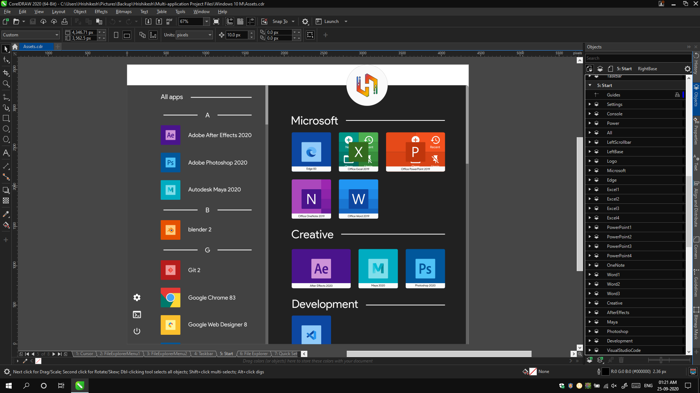

#### Adobe After Effects 2020

As I said before, the amount of animation I was going to need for this project, was only possible in Adobe After Effects. I exported my artworks as Illustrator files, imported them in After Effects and converted it all to native shape layers of After Effects. This gave me granular control over each element to be animated. Be it 3D rotation using a camera, or making the corners of notifications round, shape layers would do the trick everywhere.

#### Adobe Premiere Pro 2020

After animating in After Effects, I needed something to actually edit it, add text, time remapping, add sound, etc. While it's all possible in After Effects, I decided to ease my workflow by using an actual video editing application. Most of us would know that no other video editing application works as seamlessly with After Effects as Premiere Pro (and that would make sense, considering they're both from the same company).

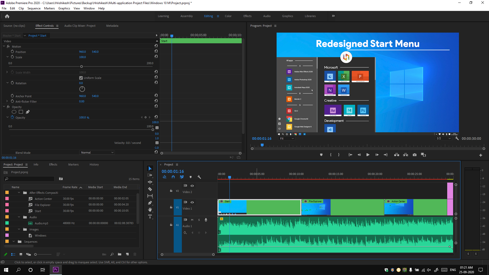

### Re-designing Windows 10

After deciding on my workflow, I now actually needed to make the design. I had 2 options, either to create one design system from scratch or use an existing one. Creating from scratch and maintaining consistency would not have been possible at my then skill level. I was completely new to UI design after all. So, I thought of replicating Apple's Human Interface Design, but, I couldn't successfully integrate it in Windows. So, I decided to switch to Google's [Material Design Language](https://www.material.io/). MDL has one of the most detailed design language documentation that includes every detail of using its components, icons, managing spacing, typography, sizes, colours and whatnot. I spent around 2 days trying to read and understand most of it first and only then I finally started designing in CorelDRAW. Because I used Material Design, it gave me the idea for the name of the project, that is, Windows 10 M, where M stands for Modern, Minimalistic and Material.

#### Start Menu

The Start Menu is probably the most important feature for almost all Windows users. It has existed in the OS since Windows 95. With each major Windows update, the Start Menu has been redesigned. Windows 8 took a step further and made the Start Menu full screen. Even after Windows 10 was introduced, Start Menu has been getting subtle design changes in some of Windows' semi-annual updates. Thus, I decided to start with the Start Menu (haha, very funny, I know).

Here are some of the changes I made in the Start Menu:

***Firstly, I decided to go with flat colours instead of the current translucent colours.***

This had a few reasons. Firstly, the flat design optimizes text legibility. It keeps a plain background colour and thus, text can have a single colour which would be clearly visible on it, no matter what. Translucent colours depend on the background. On a dark background, the text should be light-coloured and vice-versa. This isn't always the case. Either the OS will have to calculate the contrast and set colours, but, even then, it can't possibly be consistent.

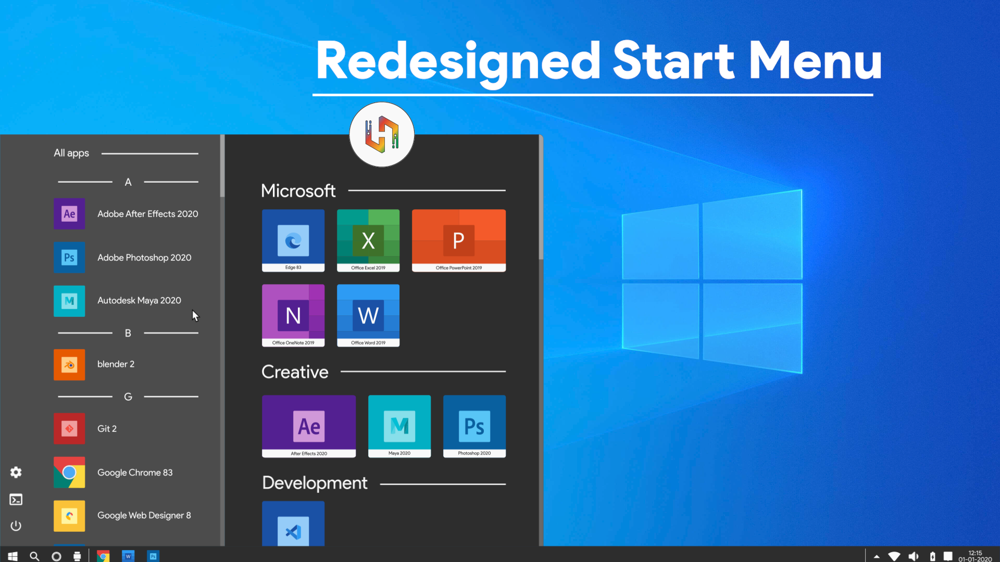

***Next, I made the scrollbars in the app list always visible.***

Currently, it's visible only when you hover near it. The reason behind making it always visible is that users will always know there's a list below the currently visible part and they know where to place the mouse to scroll. Also, the alphabetical categorization of applications is now more prominent.

***Moving on, I decided to revamp one of the cool features on the Start Menu: Quick Actions for apps.***

Quick Actions is a great way to get stuff done quickly. It lets us directly jump to the most common actions within an app. However, currently, users need to right-click. I decided to save that extra click and animate the actions on hover. Moreover, Quick Actions show up depending on the tile's size.

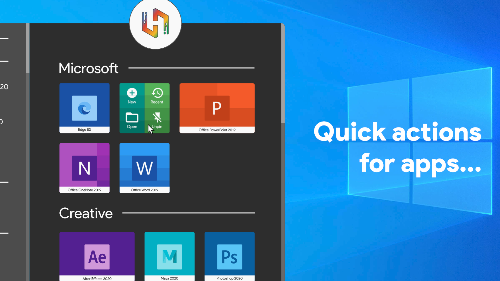

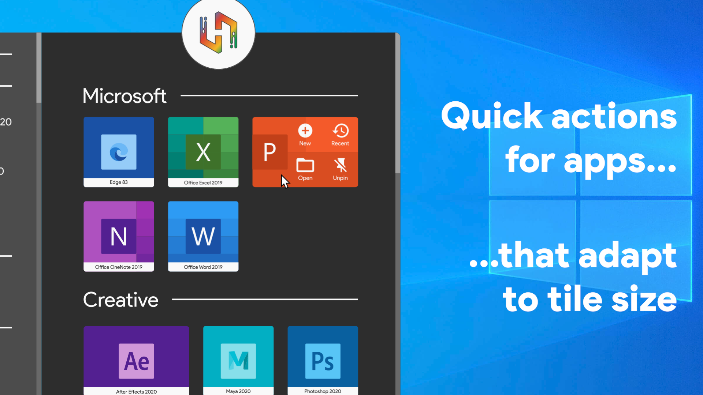

***Lastly, I made the icons consistent.***

We all use a lot of applications and each one seems to follow it's own design. But, Google introduced something great for Android 8.0 Oreo SDK 26, that is, Adaptive Icons. It separates the foreground and background layer of the icon and allows the system to reshape the background to give a consistent look while allowing the user to customize the shape and size.

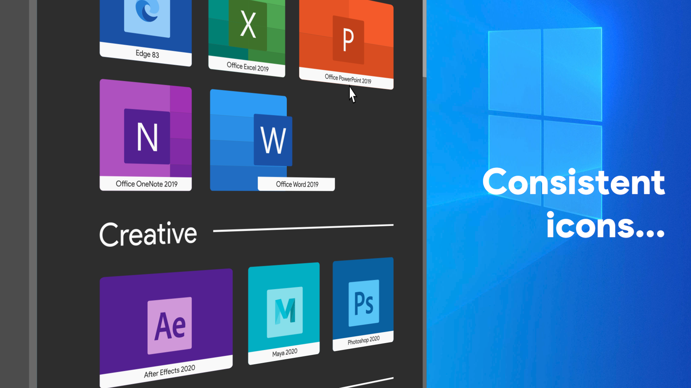

#### File Explorer

File Explorer is probably the most used Windows system application. However, Microsoft still hasn't updated it to match its Fluent Design Language. I went ahead and made my own changes following MDL:

***I took inspiration from many apps noticed a trend that entrance animations are fairly common nowadays.***

So, whenever the File Explorer is opened, the lists that expand and all content use a fade-in animation to reveal themselves.

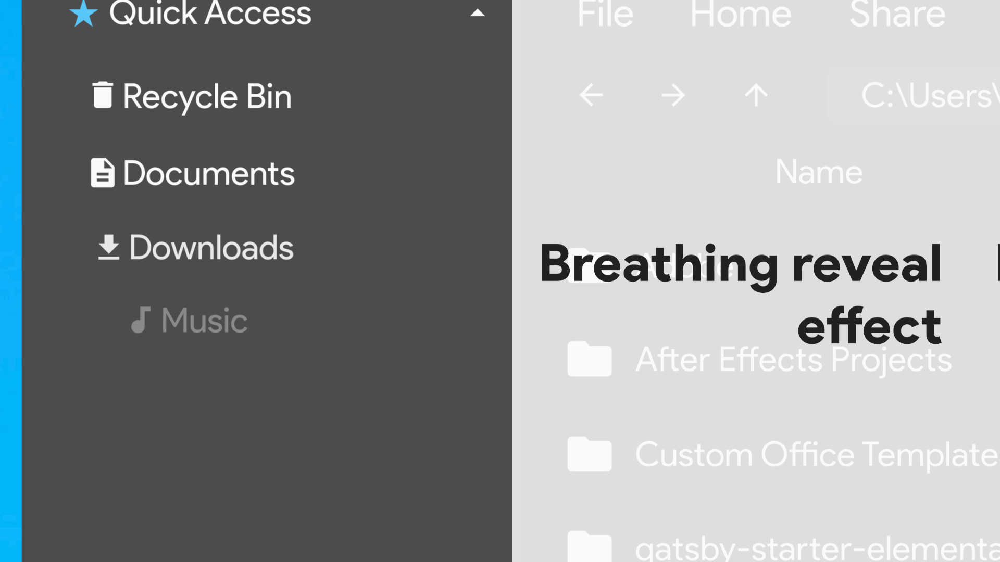

***There's a clear and persistent indication of remaining storage.***

Managing storage is a problem for most people, but, if we're constantly reminded of it, we can at least act in time. So, I added a clear and persistent indication of all available storage drives in a computer.

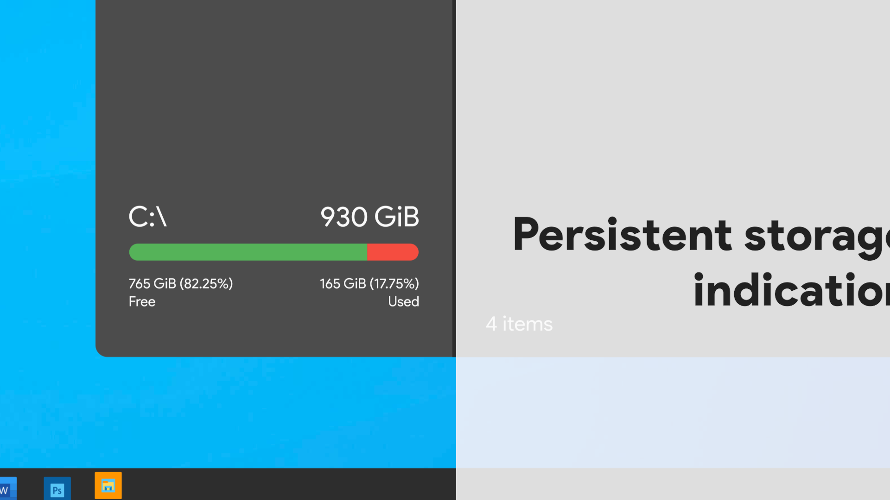

***The menus have been revamped too.***

From the beginning of Windows 10, the menus have not got a good look. Like, just take a look at macOS for that matter. The right-click menu also looks so good. Windows still has a plain grey coloured menu. I went ahead and replaced that with MDL's List component. These give more space to the user to select each item and looks more modern.

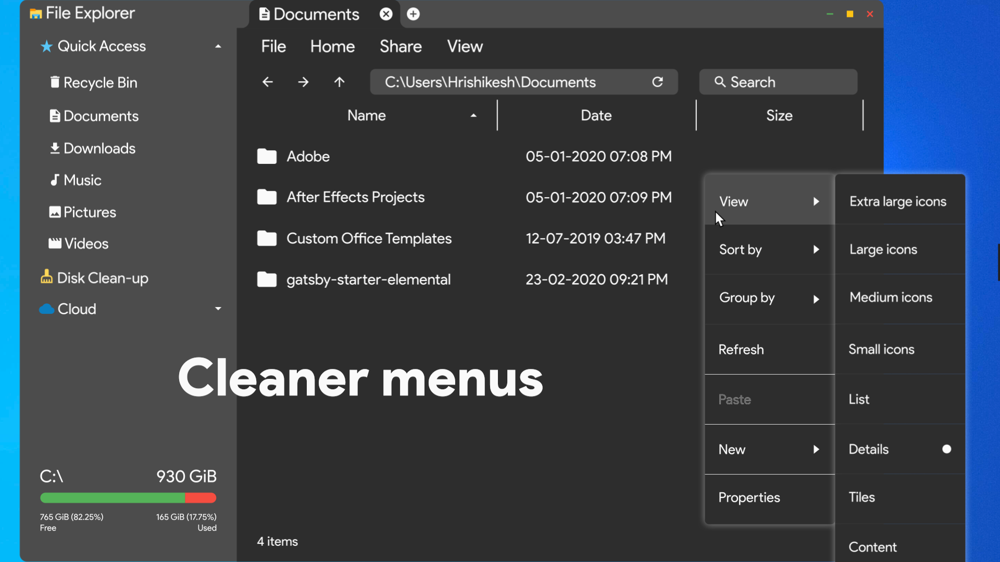

***Yes, tabbed UI in File Explorer is here.***

Well, not really, it's just a concept video after all. But, taking direct inspiration from Google Chrome's tabbed UI, I created the tab reveal animation.

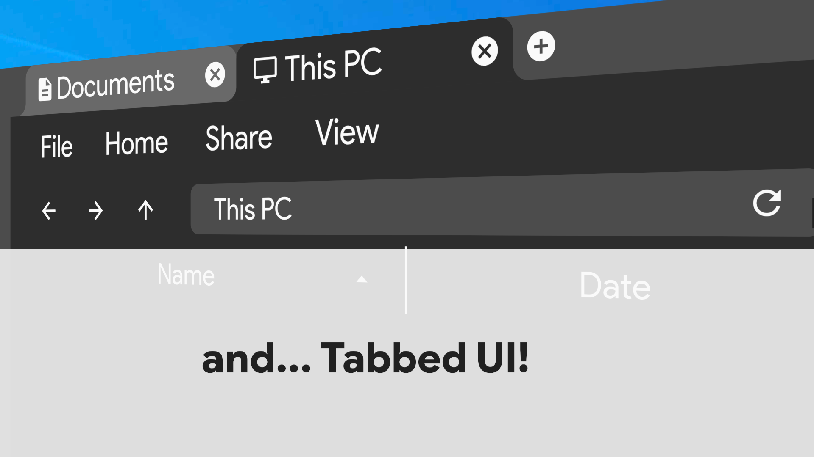

#### Action Centre

Action Centre is important yet ignored feature of Windows 10. It brings mobile OS style control centre (or quick settings) to your computer. It lets us manage a lot of settings easily, without actually digging for those in the PC Settings. So, instead of a side pane, I made it look more intuitive:

***Notifications in Windows get easily ignored.***

The current positioning of notifications in Windows makes it easy for users to ignore it. There's nothing very highlighting or something that captures the attention of the user. That defeats the purpose of notifications. But, with some proper information and reveal effects, the notifications can be made lively.

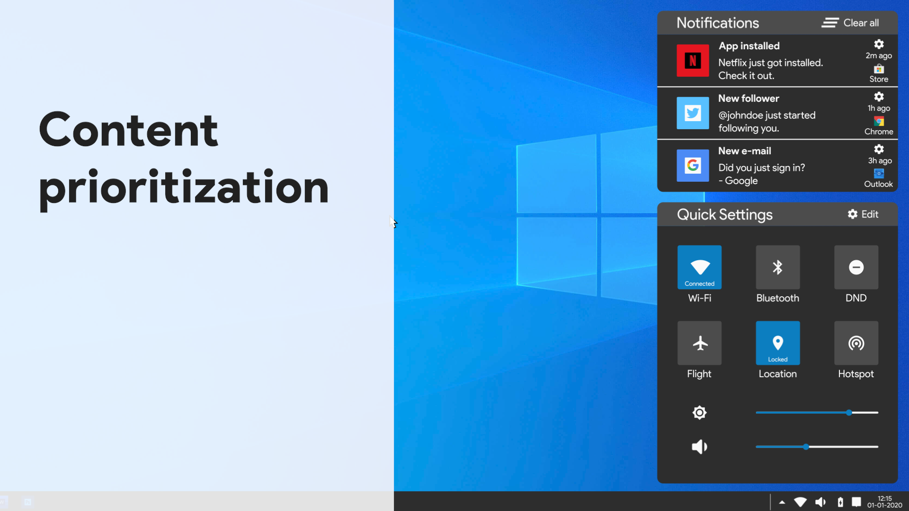

***The quick settings really needed to be quick to use.***

The action centre actually hides quick settings. Many of us might not even know they exist. We change the sound by clicking on the sound icon, change internet connectivity by clicking on its icon. It's all great. But, Windows missed 'at a glance' feature. We need something to see all the important controls of the device at a glance, that is in one look. We should be easily able to distinguish between what's on and what's off.

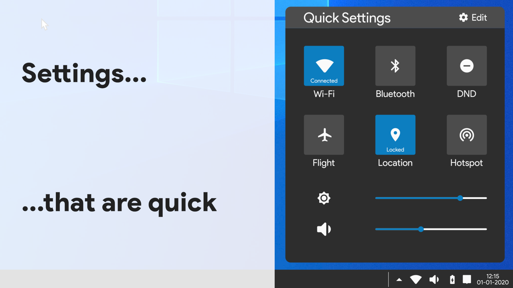

***The notification system of Windows 10 has been a work in progress.***

But, if we see Android, it has perfected the art of notifying the user. The concept video gives Windows the power to do the same. Notifications now show the notifying app, the time elapsed from the arrival of notification, and a settings icon to easily manage the notification settings on the fly. A dedicated clear all button and a clear indication of notification title and a notification message are what makes things better.

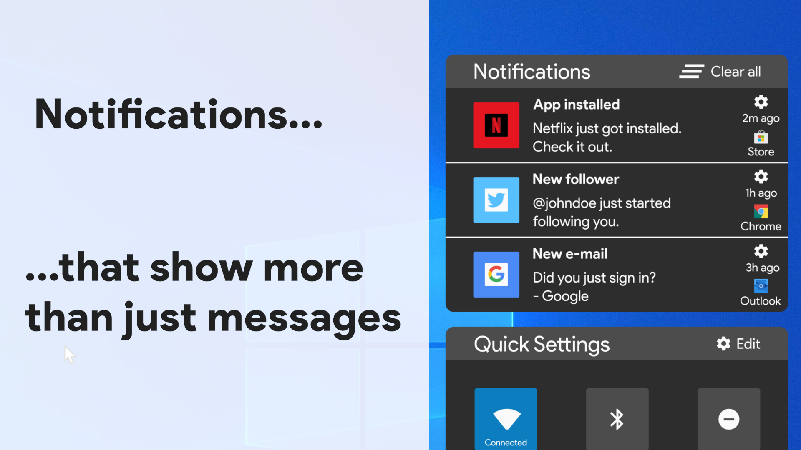

## End result

All the still images that you've been seeing till now are from the following video:



## TL;DR

Windows 10 M (Modern, Minimalistic, Material) is a self-assigned Windows 10 redesigned project that I did during the lockdown period in over a week. It had to refer to several videos, documentations to decide on how to proceed and take inspirations from various other operating systems, be it for computers or for phones.